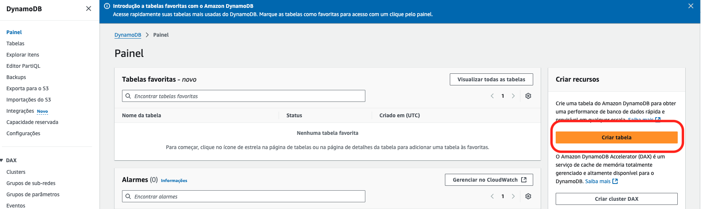
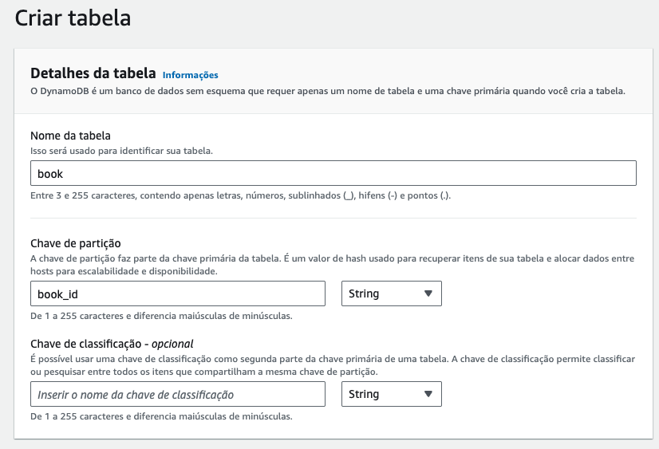
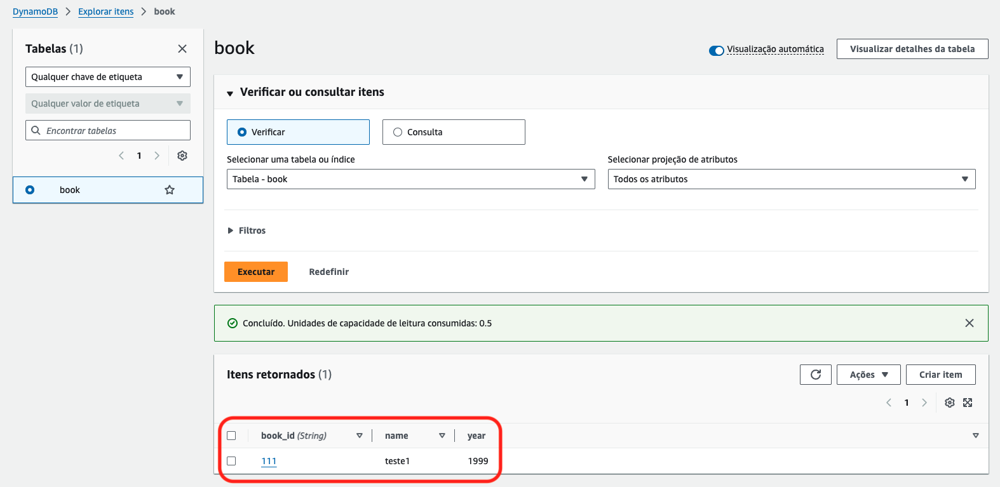
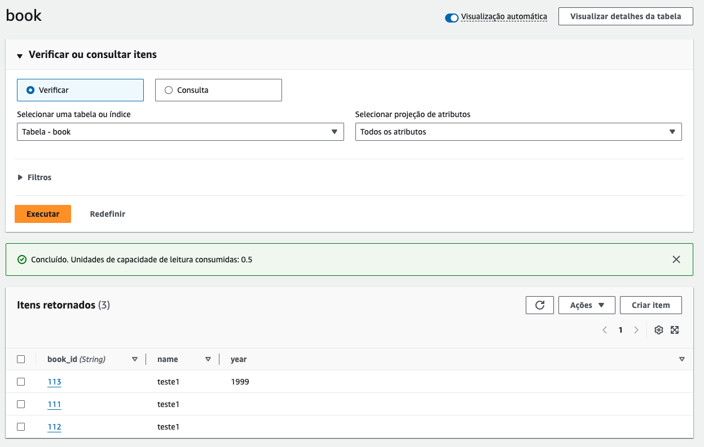

# 03.1 - Partition key

1. Clique em create table no painel do dynamoDB

2. Preencha os dados como na imagem e clique em create

3. A tabela pode levar alguns minutos para ser criada
4. Modifique o arquivo 'dynamo.py' que esta na raiz da pasta '03 - Dynamo' para que fique como na imagem

5. Para executar o arquivo basta via linha de comando ir até a pasta onde ele se encontra e rodar o comando `python3 dynamo.py`
6. Se voltar a pagina do dynamoDB e atualizar verá que temos apenas um registro. Isso ocorreu porque quando inserirmos partition keys identicas o banco sobrescreve o registro anterior.

7. Altere o arquivo 'dynamo.py' para que as partition keys fiquem diferentes

8. execute novamente o arquivo `python3 dynamo.py`
9. Agora a tabela book tem 3 registros, cada um com seu atributo
