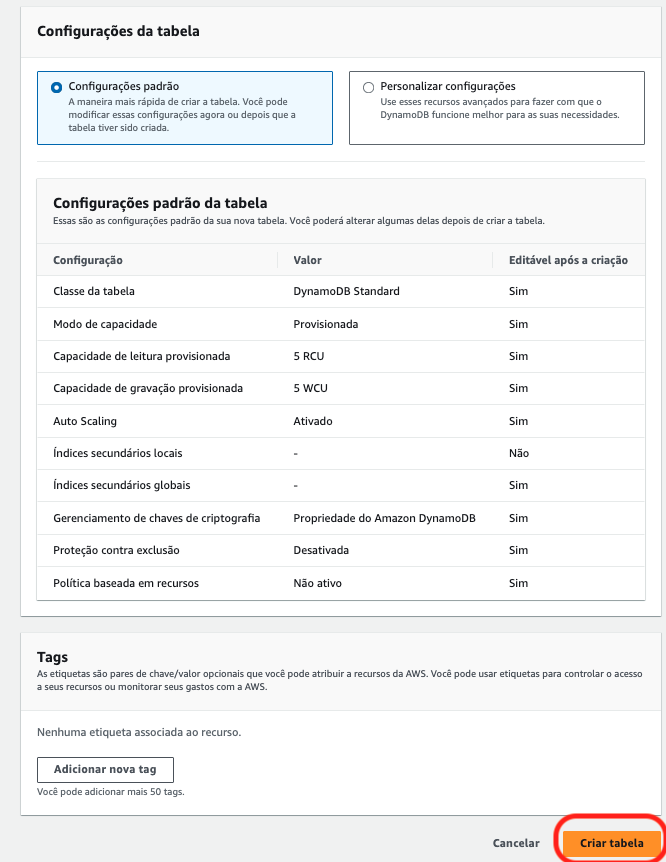

# 03.1 - Partition key

1. Acesse o [console do dynamoDB](https://us-east-1.console.aws.amazon.com/dynamodbv2/home?region=us-east-1#dashboard)
2. Clique em 'Criar Tabela' no lado direito da tela

3. Preencha os dados de `Detalhes da tabela` como na imagem abaixo:
       1. Nome da tabela: 'book'
       2. Chave de partição: 'book_id' (String)
    

4. Mantenha todos os demais parametros como padrão e clique em 'Criar Tabela'
   

> [!NOTE]  
> ### Explicação dos Campos de Criação de Tabela no Amazon DynamoDB
> A imagem exibida mostra um formulário para a criação de uma tabela no Amazon DynamoDB com diversas opções de configuração. Aqui estão os detalhes de cada campo:
    #### 1. **Configurações Padrão da Tabela**
    - **Configuração Padrão**: Esta é a opção recomendada para criar uma tabela de maneira rápida. Permite ajustar configurações posteriormente, se necessário.
    - **Personalizar Configurações**: Caso precise de configurações avançadas, esta opção permite ajustes detalhados conforme suas necessidades específicas.
    #### 2. **Configurações Padrão da Tabela**
    Esta seção fornece as configurações padrão da nova tabela que será criada:
    - **Classe da tabela**: Define a classe de armazenamento da tabela. No exemplo, está definida como **DynamoDB Standard**, que é a classe padrão de armazenamento do DynamoDB.
        - *Editável após a criação*: Sim
    - **Modo de Capacidade**: Define o modo de capacidade da tabela, que pode ser **Provisionada** ou **Sob demanda**. No exemplo, está como *Provisionada*.
        - *Editável após a criação*: Sim
    - **Capacidade de Leitura Provisionada**: Determina a quantidade de unidades de capacidade de leitura provisionada para a tabela, medida em **RCU** (Read Capacity Units). No exemplo, está configurado como **5 RCU**.
        - *Editável após a criação*: Sim
    - **Capacidade de Gravação Provisionada**: Define a quantidade de unidades de capacidade de gravação provisionada, medida em **WCU** (Write Capacity Units). No exemplo, está configurado como **5 WCU**.
        - *Editável após a criação*: Sim
    - **Auto Scaling**: Indica se o recurso de auto scaling (escalabilidade automática) está ativado para ajustar automaticamente a capacidade provisionada da tabela com base no uso.
        - *Editável após a criação*: Sim
    - **Índices Secundários Locais**: Permite definir índices secundários locais na tabela, que utilizam a chave de particionamento da tabela.
        - *Editável após a criação*: Não
    - **Índices Secundários Globais**: Permite definir índices secundários globais para a tabela, que podem utilizar chaves de particionamento e de classificação diferentes.
        - *Editável após a criação*: Sim
    - **Gerenciamento de Chaves de Criptografia**: Determina a propriedade e o gerenciamento das chaves de criptografia. No exemplo, está configurado como **Propriedade do Amazon DynamoDB**.
        - *Editável após a criação*: Sim
    - **Proteção Contra Exclusão**: Quando ativada, impede a exclusão acidental da tabela. No exemplo, está configurada como **Desativada**.
        - *Editável após a criação*: Sim
    - **Política Baseada em Recursos**: Permite definir políticas baseadas em recursos para controlar o acesso à tabela. No exemplo, está definido como **Não ativo**.
        - *Editável após a criação*: Sim
    #### 3. **Tags**
    - As tags são pares de chave/valor opcionais que podem ser atribuídos à tabela para fins de categorização, gerenciamento de custos e controle de acesso. Permite adicionar até **50 tags** para a tabela.
    #### 4. **Ações Disponíveis**
    - **Adicionar nova tag**: Botão que permite adicionar novas tags ao recurso.
    - **Criar tabela**: Botão para confirmar a criação da tabela com as configurações especificadas.

1. A tabela pode levar alguns minutos para ser criada. Aguarde.
2. De volta ao cloud9 acesse a pasta com os scripts a serem utilizados: `cd ~/environment/fiap-cloud-computing-tutorials/03-Dynamo-Base`
3. Abra o arquivo dynamo-PK-1.py utilizando o comando `c9 open dynamo-PK-1.py`

1. Antes de executar o script garanta que o boto3 está instalado. Execute o comando `pip3 install boto3`
2. Utilizando esse script você vai inserir 3 Items com o mesma PK na tabela. Execute o comando `python3 dynamo-PK-1.py`
3.  Abra uma nova aba no navegador para visualizar os [itens na tabela book](https://us-east-1.console.aws.amazon.com/dynamodbv2/home?region=us-east-1#item-explorer?maximize=true&operation=SCAN&table=book)

1.  Abra o arquivo dynamo-PK-2.py utilizando o comando `c9 open dynamo-PK-2.py`

1.  Esse script também vai inserir 3 itens na tabela, porém com PKs diferentes. `python3 dynamo-PK-2.py`
2.  Agora a tabela book tem 3 registros, cada um com seu atributo

### Documentação
[https://aws.amazon.com/pt/blogs/database/choosing-the-right-dynamodb-partition-key/](https://aws.amazon.com/pt/blogs/database/choosing-the-right-dynamodb-partition-key/)