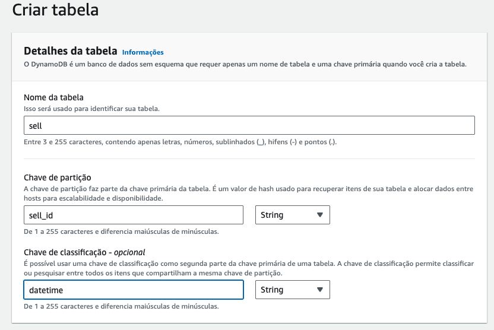
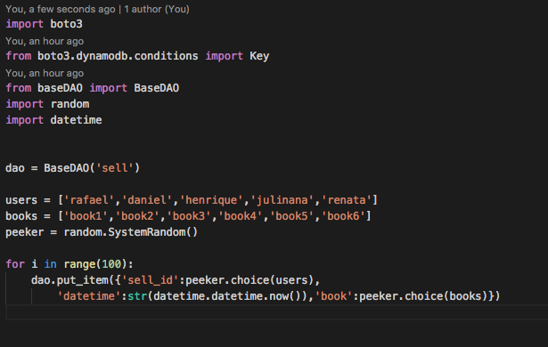
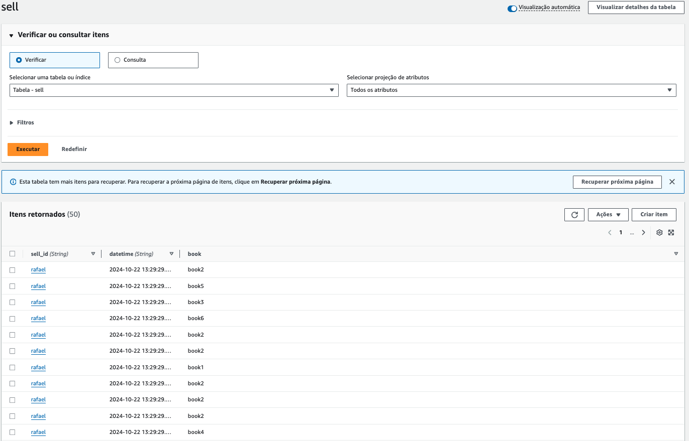
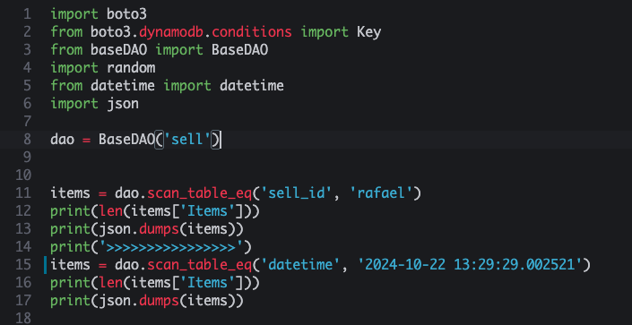
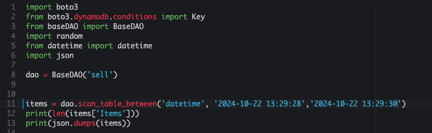
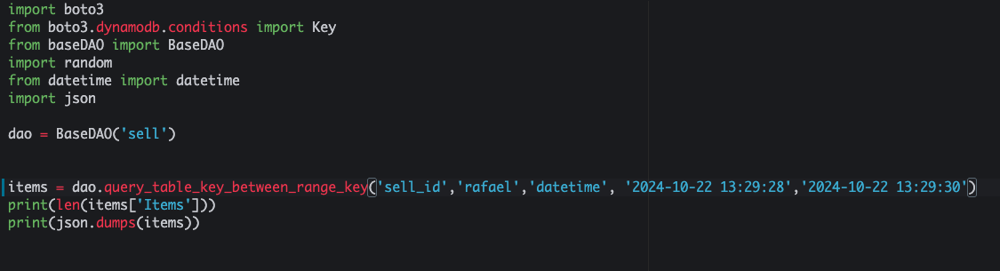
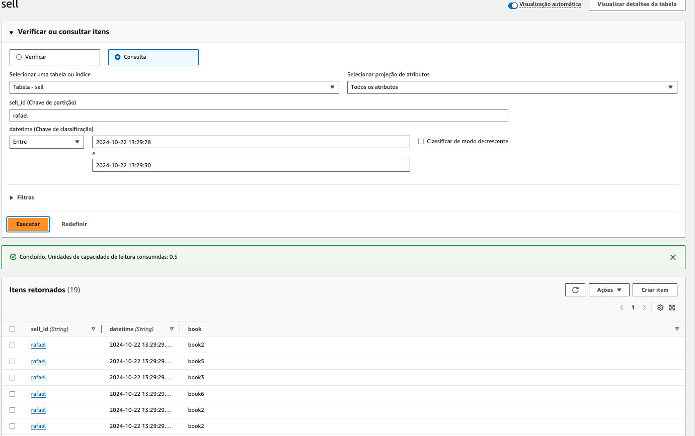

# 03.2 - Sort Key


1. Acesse o [console do dynamoDB](https://us-east-1.console.aws.amazon.com/dynamodbv2/home?region=us-east-1#dashboard)
2. Clique em 'Criar Tabela' no lado direito da tela
3. Preencha os dados como na imagem e clique em 'Criar tabela' no final da página.
   1. Nome da tabela: `sell`
   2. chave de partição: `sell_id`
   3. chave de classificação: `datetime`



4. De volta ao cloud9 acesse a pasta com os scripts a serem utilizados: `cd ~/environment/fiap-cloud-computing-tutorials/03-Dynamo-Base`
5. Abra o arquivo dynamo-SK-1.py no IDE com o comando `c9 open dynamo-SK-1.py`



<blockquote>

O código apresentado insere 100 itens aleatórios em uma tabela chamada **`sell`** no Amazon DynamoDB. A lógica de funcionamento baseia-se em escolher aleatoriamente um usuário, um livro e a data e hora atuais para criar cada item na tabela. Vamos detalhar como o código funciona e o que ele faz:

### Explicação do Código

1. **Instância do `BaseDAO`**:
   ```python
   dao = BaseDAO('sell')
   ```
   - Aqui, cria-se uma instância da classe `BaseDAO` que está associada a uma tabela DynamoDB chamada `'sell'`. 
   - A classe `BaseDAO` provavelmente abstrai operações básicas do DynamoDB, como `put_item`, para facilitar a interação com a tabela.

2. **Listas de Usuários e Livros**:
   ```python
   users = ['rafael','pedro','teresa','natalia', 'eduardo']
   books = ['book1','book2','book3','book4','book5','book6']
   ```
   - A variável `users` contém uma lista de cinco nomes de usuários.
   - A variável `books` contém uma lista de seis livros.

3. **Inicialização de `peeker`**:
   ```python
   peeker = random.SystemRandom()
   ```
   - Aqui, é criada uma instância de `SystemRandom`, que utiliza uma fonte de entropia do sistema operacional para gerar números aleatórios de maneira mais segura.
   - Essa instância será usada para selecionar aleatoriamente elementos das listas `users` e `books` e criar dados únicos para cada iteração.

4. **Laço `for` para Inserir 100 Itens**:
   ```python
   for i in range(100):
       dao.put_item({'sell_id': peeker.choice(users), 
           'datetime':str(datetime.now()),'book':peeker.choice(books)})
   ```
   - O laço `for` executa 100 vezes, inserindo 100 itens na tabela `'sell'`.
   - Em cada iteração:
     - **`sell_id`**: Um valor é escolhido aleatoriamente da lista `users` usando o método `peeker.choice(users)`. Isso significa que o `sell_id` será um dos nomes da lista (`rafael`, `pedro`, etc.).
     - **`datetime`**: O valor de `datetime` é o momento atual (com precisão de milissegundos), gerado pela função `datetime.now()` e convertido em uma string.
     - **`book`**: Um valor é escolhido aleatoriamente da lista `books` usando `peeker.choice(books)`, então o atributo `book` será um dos seis livros listados (`book1`, `book2`, etc.).

### Funcionamento Detalhado

- **Chave Primária**: Embora o código utilize o campo `'sell_id'` (que é o ID do vendedor ou usuário), não sabemos com certeza se esse é o único atributo que compõe a chave primária da tabela. Caso `'sell_id'` seja a única chave primária definida na tabela `sell`, então registros repetidos com o mesmo `sell_id` irão sobrescrever os anteriores (porque as chaves primárias no DynamoDB devem ser únicas). Se a tabela usar uma chave composta (por exemplo, `'sell_id'` e `'datetime'`), então cada registro será único, já que a `datetime` será diferente em cada iteração.

- **Inserção Aleatória**: Para cada uma das 100 iterações do laço, o código escolhe aleatoriamente um usuário da lista `users`, um livro da lista `books`, e registra o horário atual. Cada combinação de `sell_id`, `datetime`, e `book` é então inserida na tabela DynamoDB.

### Resultado Final

Após a execução do código, a tabela `'sell'` no DynamoDB terá 100 itens com a seguinte estrutura de atributos:

- **`sell_id`**: Um valor escolhido aleatoriamente da lista `users`.
- **`datetime`**: A data e hora do momento em que o item foi inserido, no formato de string.
- **`book`**: Um valor escolhido aleatoriamente da lista `books`.

Exemplo de itens inseridos:
```json
{
    "sell_id": "rafael",
    "datetime": "2024-10-22 12:45:30.123456",
    "book": "book1"
}
{
    "sell_id": "teresa",
    "datetime": "2024-10-22 12:45:31.654321",
    "book": "book5"
}
```

### Considerações

- Se o campo `'sell_id'` for a chave primária única da tabela, alguns itens podem ser sobrescritos, já que existe uma possibilidade de repetição do mesmo `sell_id`.
- Se a chave primária for composta (por exemplo, `'sell_id'` + `'datetime'`), então todos os 100 itens serão inseridos como registros únicos.

Portanto, o resultado do código é que 100 itens aleatórios são inseridos na tabela `'sell'`, onde os valores de `'sell_id'`, `'datetime'`, e `'book'` são gerados dinamicamente.
</blockquote>

6. Esse script irá popular de maneira randomica combinações dos objetos das listas users e books. Execute o comando `python3 dynamo-SK-1.py`
7. Agora sua tabela estará populada com 100 objetos. [Listar itens tabela sell](https://us-east-1.console.aws.amazon.com/dynamodbv2/home?region=us-east-1#item-explorer?maximize=true&operation=SCAN&table=sell)



8. Abra o arquivo dynamo-SK-2.py no IDE com o comando `c9 open dynamo-SK-2.py`
9. Escolha um dos datetimes e um dos nomes que constam na sua tabela sell e altere o arquivo 'dynamo-SK-2' para que fique como na imagem. Copie de valores da sua tabela, caso contrario não retornará nenhum valor. Não esqueça de salvar com ctrl+s



<blockquote>
### Explicação do Código

Este código interage com uma tabela chamada **`sell`** no Amazon DynamoDB. O objetivo principal é escanear a tabela utilizando duas diferentes condições de filtro: uma baseada no campo **`sell_id`** e outra no campo **`datetime`**. Vamos analisar cada parte do código e seus resultados:

### Instância do `BaseDAO`
```python
dao = BaseDAO('sell')
```
- Aqui, cria-se uma instância da classe `BaseDAO`, que está associada à tabela DynamoDB chamada `'sell'`. 
- A classe `BaseDAO` é responsável por realizar operações no DynamoDB, como varreduras (scans), consultas, inserções, etc. No caso, é usada para varrer a tabela com base em condições.

### Varredura por `sell_id`
```python
items = dao.scan_table_eq('sell_id', 'rafael')
print(len(items['Items']))
print(json.dumps(items))
```
- O método **`scan_table_eq`** é utilizado para realizar uma operação de **scan** na tabela, filtrando os itens que possuem o campo **`sell_id`** igual a `'rafael'`.
- O resultado do scan retorna todos os itens da tabela `sell` que tenham o valor `'rafael'` no campo `sell_id`.
- **`items`** é um dicionário que contém a lista de itens retornados pelo scan, normalmente acessível por meio da chave `'Items'`.

#### Comportamento do Código:
- **`print(len(items['Items']))`**: Imprime o número de itens que atendem ao critério de `sell_id = 'rafael'`.
- **`print(json.dumps(items))`**: Imprime todos os itens retornados pelo scan em formato JSON, para visualização detalhada.

#### Resultado:
- O código vai exibir a quantidade de itens que possuem `sell_id = 'rafael'` e vai listar todos os itens que atendem a esse critério no formato JSON.
  
  Exemplo de saída:
  ```
  5  # Exemplo de quantidade de itens encontrados
  {
      "Items": [
          {"sell_id": "rafael", "datetime": "2024-10-22 12:45:30.123456", "book": "book1"},
          {"sell_id": "rafael", "datetime": "2024-10-22 12:47:10.654321", "book": "book5"},
          ...  # Mais itens
      ]
  }
  ```

### Varredura por `datetime`
```python
items = dao.scan_table_eq('datetime', '2021-05-05 16:55:56.233241')
print(len(items['Items']))
print(json.dumps(items))
```
- Aqui, realiza-se uma nova varredura na tabela, agora filtrando os itens que possuem o campo **`datetime`** igual a `'2021-05-05 16:55:56.233241'`.
- O código busca itens que correspondem a esse valor exato de data e hora no campo `datetime`.

#### Comportamento do Código:
- **`print(len(items['Items']))`**: Imprime o número de itens que têm o campo `datetime` com o valor exato especificado.
- **`print(json.dumps(items))`**: Imprime os itens retornados no formato JSON.

#### Resultado:
- A varredura retornará os itens com o campo `datetime` igual a `'2021-05-05 16:55:56.233241'`. Como datas e horas precisam de uma correspondência exata, é provável que a consulta retorne 0 ou poucos itens, a menos que algum item tenha sido inserido com essa data específica.
  
  Exemplo de saída:
  ```
  0  # Exemplo de quantidade de itens encontrados
  {
      "Items": []
  }
  ```

### Resumo Geral

- O código realiza duas operações de **scan** na tabela **`sell`**, utilizando a função `scan_table_eq` da classe `BaseDAO`, que filtra itens com base em um campo e valor específicos.
- A primeira operação busca todos os itens cujo campo **`sell_id`** seja igual a `'rafael'`. 
  - O código imprime o número de itens encontrados e seus detalhes.
- A segunda operação busca itens cujo campo **`datetime`** seja igual a `'2021-05-05 16:55:56.233241'`.
  - O código imprime o número de itens encontrados e seus detalhes.
  
### Resultados Esperados
- O primeiro scan retorna todos os itens com `sell_id = 'rafael'` e imprime o número de itens e seus dados em JSON.
- O segundo scan tenta encontrar itens com o valor exato de `datetime` e imprime o resultado, que provavelmente será 0 ou um número pequeno, pois a busca de data e hora exatas tende a ser muito específica.

</blockquote>

10. Execute o arquivo com `python3 dynamo-SK-2.py`
11. Abra o arquivo dynamo-SK-3.py no IDE com o comando `c9 open dynamo-SK-3.py`
12. Escolha um intervalo de tempo em sua tabela e deixe seu arquivo 'dynamo-SK-3.py' como na imagem. Ao visualizar os dados na tabela do dynamo ordene por data para facilitar copiar 2 datas crescentes.



<blockquote>
Este código realiza uma varredura em uma tabela chamada **`sell`** no Amazon DynamoDB, buscando itens que possuem o valor do campo **`datetime`** dentro de um intervalo de tempo específico. Vamos explicar como o código funciona e os resultados esperados.

### Instância do `BaseDAO`
```python
dao = BaseDAO('sell')
```
- Aqui, uma instância da classe `BaseDAO` é criada e associada à tabela DynamoDB chamada `'sell'`. A classe `BaseDAO` abstrai operações no DynamoDB, como escaneamento, consultas, inserções, etc.

### Varredura com Condição de Intervalo (`between`)
```python
items = dao.scan_table_between('datetime', '2024-10-22 13:29:28', '2024-10-22 13:29:30')
```
- **`scan_table_between`**: Este é um método customizado dentro da classe `BaseDAO` que executa uma operação de varredura (**scan**) na tabela, buscando itens cujo valor de um determinado campo esteja **entre dois valores**. 
- No caso, o campo especificado para a busca é **`datetime`**, e o intervalo é entre `'2024-10-22 13:29:28'` e `'2024-10-22 13:29:30'`.
  - Isso significa que o código está buscando todos os itens onde o valor do campo **`datetime`** esteja dentro desse intervalo de dois segundos (entre `'2024-10-22 13:29:28'` e `'2024-10-22 13:29:30'`).

### Impressão dos Resultados
```python
print(len(items['Items']))
print(json.dumps(items))
```
- **`len(items['Items'])`**: Exibe o número de itens que foram encontrados no intervalo de tempo especificado.
- **`json.dumps(items)`**: Imprime os itens encontrados em formato JSON, o que facilita a visualização dos dados.

### Funcionamento Geral
1. **`scan_table_between('datetime', '2024-10-22 13:29:28', '2024-10-22 13:29:30')`**: Realiza uma varredura na tabela, retornando todos os itens cujo campo `datetime` tenha um valor entre `'2024-10-22 13:29:28'` e `'2024-10-22 13:29:30'`. Esses valores de `datetime` são strings que representam data e hora.
   
2. **`print(len(items['Items']))`**: Conta quantos itens foram retornados pela varredura e imprime esse número.
   
3. **`print(json.dumps(items))`**: Converte os itens retornados em formato JSON e imprime todos eles para exibir detalhes como `sell_id`, `datetime`, e outros atributos que possam estar nos itens.

### Resultados Esperados
- O código vai procurar todos os itens na tabela **`sell`** que possuem um valor de **`datetime`** no intervalo exato de dois segundos entre `'2024-10-22 13:29:28'` e `'2024-10-22 13:29:30'`.
- O número de itens encontrados será impresso.
- Todos os itens correspondentes serão exibidos em formato JSON, contendo seus atributos (por exemplo, `sell_id`, `datetime`, `book`, etc.).

Exemplo de saída esperada:
```
2  # Exemplo de número de itens encontrados
{
    "Items": [
        {"sell_id": "rafael", "datetime": "2024-10-22 13:29:29", "book": "book1"},
        {"sell_id": "teresa", "datetime": "2024-10-22 13:29:29", "book": "book4"}
    ]
}
```

### Conclusão

Este código busca itens na tabela **`sell`** com base em um intervalo de tempo definido no campo **`datetime`**, utilizando a função `scan_table_between` para encontrar todos os itens cujos valores de `datetime` estejam entre `'2024-10-22 13:29:28'` e `'2024-10-22 13:29:30'`. O código imprime o número de itens encontrados e os detalhes desses itens em formato JSON.
</blockquote>


14.  Execute o arquivo com `python3 dynamo-SK-3.py`
15.  Abra o arquivo dynamo-SK-4.py no IDE com o comando `c9 open dynamo-SK-4.py`
16.  Escolha um nome e um intervalo de tempo que tenha registros e altere o arquivo 'dynamo-SK-4.py' como na imagem



<blockquote>
### Explicação do Código

Este código realiza uma **consulta** na tabela **`sell`** do DynamoDB, filtrando itens com base em uma chave de partição específica e um intervalo em uma chave de ordenação. Vamos detalhar o funcionamento do código e os resultados esperados.

### Instância do `BaseDAO`
```python
dao = BaseDAO('sell')
```
- Uma instância da classe `BaseDAO` é criada e associada à tabela **`sell`** no DynamoDB. A classe `BaseDAO` provavelmente contém métodos para facilitar a interação com o DynamoDB, incluindo consultas e operações de varredura.

### Consulta com Chave de Partição e Intervalo de Chave de Ordenação
```python
items = dao.query_table_key_between_range_key('sell_id', 'rafael', 'datetime', '2024-10-22 13:29:28', '2024-10-22 13:29:30')
```
Este método faz uma consulta no DynamoDB com base em dois critérios:
- **Chave de partição (`sell_id`)**: Busca itens onde o campo **`sell_id`** seja igual a `'rafael'`.
- **Intervalo da chave de ordenação (`datetime`)**: Além de garantir que a chave de partição seja igual a `'rafael'`, o código também filtra os resultados com base em um intervalo de valores no campo **`datetime`**. Ele busca itens onde o campo `datetime` esteja entre `'2024-10-22 13:29:28'` e `'2024-10-22 13:29:30'`.

Esse tipo de consulta é possível em tabelas do DynamoDB que possuem **chave composta** (chave de partição + chave de ordenação), onde a chave de partição é usada para determinar os "grupos" de itens e a chave de ordenação é usada para filtrar itens dentro desse grupo.

### Impressão dos Resultados
```python
print(len(items['Items']))
print(json.dumps(items))
```
- **`len(items['Items'])`**: Imprime o número de itens que correspondem aos critérios da consulta.
- **`json.dumps(items)`**: Converte os itens retornados pela consulta em formato JSON e os imprime, o que facilita a visualização dos dados.

### Funcionamento Geral

1. **`query_table_key_between_range_key`**:
   - Este método realiza uma **consulta** (query) em vez de uma **varredura** (scan). A consulta no DynamoDB é mais eficiente que uma varredura, pois ela usa diretamente a chave de partição para buscar os itens.
   - O método filtra itens com `sell_id = 'rafael'` e restringe os resultados a itens cujo campo `datetime` esteja entre `'2024-10-22 13:29:28'` e `'2024-10-22 13:29:30'`.
   
2. **`print(len(items['Items']))`**:
   - Conta quantos itens foram retornados pela consulta e imprime esse número.

3. **`print(json.dumps(items))`**:
   - Converte os itens retornados pela consulta em JSON e os imprime para visualização detalhada.

### Resultado Esperado

O código irá retornar e imprimir os itens da tabela **`sell`** onde:
- O **`sell_id`** é `'rafael'` (chave de partição).
- O **`datetime`** está no intervalo de `'2024-10-22 13:29:28'` a `'2024-10-22 13:29:30'` (chave de ordenação).

#### Exemplo de Saída:
```json
2  # Exemplo de número de itens encontrados
{
    "Items": [
        {"sell_id": "rafael", "datetime": "2024-10-22 13:29:29", "book": "book1"},
        {"sell_id": "rafael", "datetime": "2024-10-22 13:29:30", "book": "book3"}
    ]
}
```

### Considerações

- **Chave de Partição (`sell_id`)**: Como a consulta está filtrando por `sell_id = 'rafael'`, ela só retorna itens pertencentes a esse grupo.
- **Chave de Ordenação (`datetime`)**: O intervalo de tempo filtrado garante que somente os itens com `datetime` dentro de `'2024-10-22 13:29:28'` e `'2024-10-22 13:29:30'` sejam retornados.

### Conclusão

O código faz uma consulta eficiente no DynamoDB, retornando itens da tabela **`sell`** onde o `sell_id` é `'rafael'` e o campo `datetime` está em um intervalo de tempo específico. A consulta usa uma chave composta para realizar essa operação, sendo mais rápida e eficiente que uma varredura, pois utiliza índices diretamente. O resultado é exibido como o número de itens encontrados e uma lista dos itens em formato JSON.

</blockquote>

17.  Execute o arquivo com `python3 dynamo-SK-4.py`
18.  No [console do dynamodb](https://us-east-1.console.aws.amazon.com/dynamodbv2/home?region=us-east-1#item-explorer?maximize=true&operation=QUERY&table=sell) execute uma consulta com os mesmos parametros para comparar os resultados. Eles devem ser iguais aos do dynamo-SK-4.py.




<blockquote>

# Diferença entre Scan e Query no DynamoDB

No Amazon DynamoDB, as operações de **Scan** e **Query** são amplamente utilizadas para recuperar dados de uma tabela. Embora possam parecer semelhantes à primeira vista, existem diferenças cruciais em como essas operações funcionam, sua eficiência e em que cenários elas devem ser aplicadas. Vamos explorar essas diferenças em detalhes.

## O que é Scan?

A operação **Scan** no DynamoDB verifica todos os itens de uma tabela ou de um índice secundário. Ele retorna todos os itens da tabela que correspondem às condições fornecidas, mas o principal ponto aqui é que o **Scan examina toda a tabela** ou o índice, independentemente de filtros. Isso pode ser ineficiente em tabelas grandes.

### Características do Scan:
- **Verificação Total**: O **Scan** verifica todos os itens da tabela ou do índice secundário, sem usar índices para buscar diretamente por valores específicos.
- **Filtros Aplicados Após a Leitura**: Filtros podem ser aplicados aos dados, mas **somente após o DynamoDB ter lido todos os itens** da tabela ou do índice. Portanto, se houver muitos itens que não correspondem ao filtro, eles ainda serão lidos, o que pode resultar em alta latência.
- **Custos e Eficiência**: Como o **Scan** precisa ler toda a tabela, ele pode consumir muitas **Unidades de Capacidade de Leitura** (Read Capacity Units - RCU), principalmente em tabelas grandes, resultando em operações mais lentas e caras.

### Exemplo de Uso:
```python
response = table.scan(
    FilterExpression=Attr('status').eq('active')
)
```
Neste exemplo, o **Scan** irá ler todos os itens da tabela e depois aplicar um filtro para retornar apenas os itens com `status = 'active'`.

## O que é Query?

A operação **Query** no DynamoDB é usada para buscar itens com base na **chave de partição** e, opcionalmente, na **chave de ordenação**. Ela é muito mais eficiente que o **Scan**, pois consulta diretamente os itens relacionados à chave de partição especificada, sem verificar toda a tabela.

### Características do Query:
- **Busca Focada**: O **Query** recupera itens **somente com base em uma chave de partição** específica. Se a tabela ou o índice tiver uma chave de ordenação, você pode usá-la para definir intervalos de valores ou ordenação dos itens retornados.
- **Eficiência**: Como o **Query** faz uso da chave de partição, ele não precisa ler toda a tabela, resultando em uma operação muito mais rápida e eficiente em termos de consumo de RCUs.
- **Filtros Adicionais**: Além de usar a chave de partição e a chave de ordenação, você pode aplicar condições adicionais de filtro, mas isso não afeta os itens lidos, apenas os itens retornados.

### Exemplo de Uso:
```python
response = table.query(
    KeyConditionExpression=Key('user_id').eq('123')
)
```
Neste exemplo, o **Query** busca todos os itens que possuem `user_id = 123`. Esta operação é altamente eficiente, pois busca diretamente a partição correspondente.

## Principais Diferenças

| Aspecto                    | Scan                                               | Query                                              |
|----------------------------|----------------------------------------------------|----------------------------------------------------|
| **Escopo de Busca**         | Verifica todos os itens da tabela ou do índice     | Recupera itens com base na chave de partição       |
| **Eficiência**              | Ineficiente em tabelas grandes, pois lê todos os itens | Muito mais eficiente, pois foca em partições específicas |
| **Filtros**                 | Aplicados após a leitura de todos os itens         | Utiliza a chave de partição e opcionalmente a chave de ordenação para restringir resultados |
| **Consumo de RCUs**         | Alto, principalmente em tabelas grandes            | Baixo, dependendo do número de itens na partição   |
| **Casos de Uso**            | Quando você precisa verificar toda a tabela        | Quando você conhece a chave de partição e deseja resultados específicos |

## Quando Usar Cada Um?

- **Scan** deve ser usado quando:
  - Você precisa realizar uma operação de leitura em toda a tabela ou em um índice secundário.
  - Você não conhece os valores de chave de partição para consultar.
  - Seu volume de dados é pequeno ou há uma necessidade específica de examinar todos os itens.

- **Query** deve ser usado quando:
  - Você sabe os valores da chave de partição.
  - Você quer buscar itens de forma eficiente em grandes volumes de dados.
  - O objetivo é recuperar itens que pertencem a uma partição específica com base em um identificador conhecido.

## Referências

Para mais informações e boas práticas sobre as operações de **Scan** e **Query**, consulte a documentação oficial da AWS:
- [DynamoDB Query and Scan Best Practices](https://docs.aws.amazon.com/amazondynamodb/latest/developerguide/bp-query-scan.html)
- [DynamoDB Query Operation](https://docs.aws.amazon.com/amazondynamodb/latest/developerguide/Query.html)
- [DynamoDB Scan Operation](https://docs.aws.amazon.com/amazondynamodb/latest/developerguide/Scan.html)

---

Essas operações são fundamentais para trabalhar com o DynamoDB de maneira eficiente, e entender suas diferenças pode ajudar a otimizar seu uso de recursos e melhorar o desempenho das suas aplicações.
</bockquote>