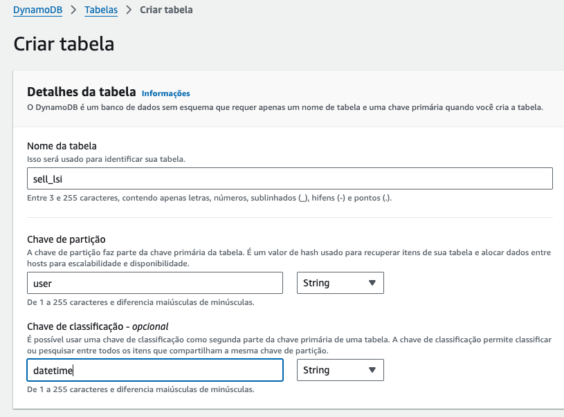
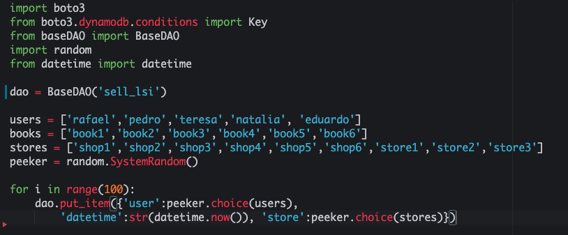
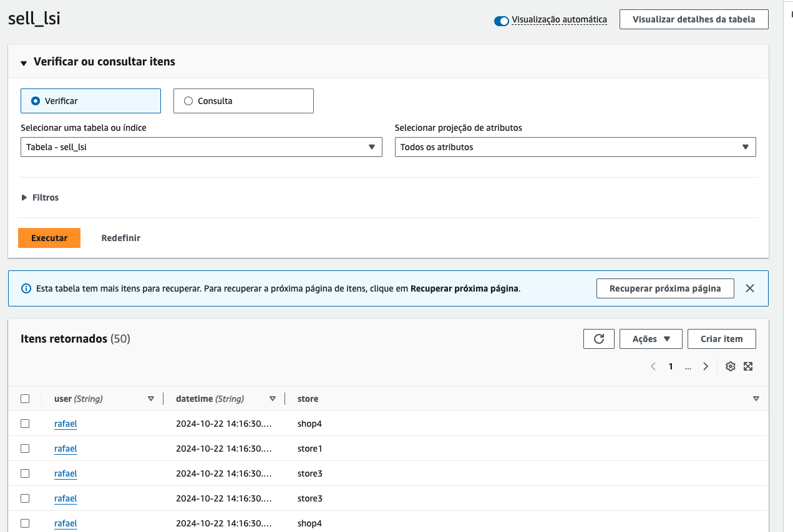
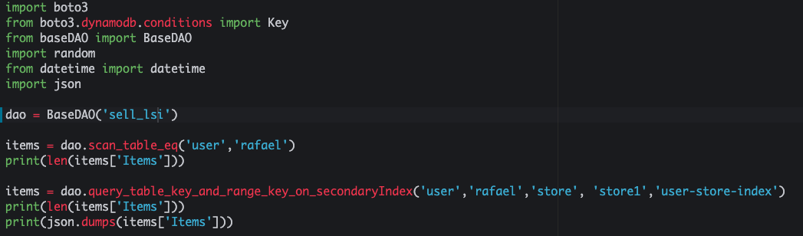

# 03.3 - Local Secondary Key

1. Clique um 'Create table' e preencha o formulário como na imagem, após clique em '+ Add Index'

2. Preencha o Index com as seguintes informações e clique em 'Add Index'

3. Desmarque as opções de Auto Scalling e deixe o 'Provisioned capacity' como na imagem, e clique em 'Create'

4. Altere o arquivo 'dynamo.py' para inserir registros na tabela criada como na imagem
 
5. Execute o arquivo com `python3 dynamo.py`

6. Escolha um usuario e um range de um segundo para executar o arquivo 'dynamo.py' como no exemplo

7. execute o comando `python3 dynamo.db`
8. Escolha uma store e altere o arquivo 'dynamo.py'

9. Execute o comando `python3 dynamo.py`