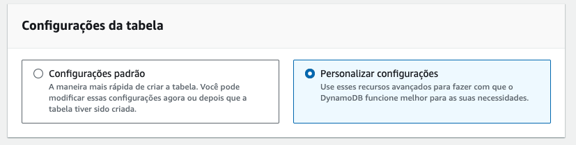

# 03.3 - Local Secondary Key

1. Acesse o [console do dynamoDB](https://us-east-1.console.aws.amazon.com/dynamodbv2/home?region=us-east-1#dashboard)
2. Clique em 'Criar Tabela' no lado direito da tela e preencha `Detalhes da tabela` com as seguintes informações:
   1. nome da tabela: `sell_lsi`
   2. Chave de partição: `user`
   3. chave de classificação: `datetime`
   


3. Em `Configurações da tabela` clique em `Personalizar configurações`




4. Em `Configurações da capacidade de leitura/gravação` selecione `Sob demanda`


<blockquote>

# Diferença entre Capacidade Sob Demanda e Provisionada no DynamoDB

O Amazon DynamoDB oferece dois modos de capacidade principais para lidar com a escalabilidade e o gerenciamento de custos: **Capacidade Sob Demanda** e **Capacidade Provisionada**. A escolha entre esses dois modos influencia como sua tabela escala e como você é cobrado pelo uso de leitura e gravação.

## Capacidade Sob Demanda

A **Capacidade Sob Demanda** é ideal para cenários em que a carga de trabalho é imprevisível ou varia significativamente ao longo do tempo. Nesse modo, o DynamoDB gerencia automaticamente a capacidade necessária para lidar com qualquer quantidade de tráfego que sua aplicação gera, sem necessidade de planejamento antecipado.

### Características da Capacidade Sob Demanda:
- **Escalabilidade Automática**: O DynamoDB ajusta automaticamente a capacidade para lidar com picos de tráfego, sem a necessidade de intervenção manual ou planejamento de capacidade.
- **Cobrança por Requisição**: Você paga apenas pelas leituras e gravações realizadas. Isso inclui **Unidades de Leitura Fortemente Consistente** (RCUs) e **Unidades de Gravação** (WCUs).
- **Ideal para Tráfego Variável**: Ótimo para aplicativos com padrões de uso imprevisíveis ou onde a carga de trabalho pode variar significativamente.
- **Não Requer Planejamento de Capacidade**: Como a escalabilidade é automática, não é necessário provisionar antecipadamente a capacidade.

### Quando Usar:
- Quando o tráfego da aplicação é imprevisível ou possui grandes variações de uso.
- Em aplicações novas, onde o volume de acessos é desconhecido.
- Para cenários de cargas de trabalho esporádicas ou intermitentes.

### Exemplo de Casos de Uso:
- Aplicativos móveis ou web com padrões de tráfego imprevisíveis.
- Aplicações com crescimento rápido e súbito em uso.
- Workloads com eventos sazonais, como campanhas de marketing ou vendas de ingressos.

### Exemplo de Configuração:
```python
dynamodb.create_table(
    TableName='my_table',
    BillingMode='PAY_PER_REQUEST',
    ...
)
```

### Documentação Oficial:
- [Capacidade Sob Demanda](https://docs.aws.amazon.com/pt_br/amazondynamodb/latest/developerguide/on-demand-capacity-mode.html)

## Capacidade Provisionada

A **Capacidade Provisionada** é mais adequada para aplicações com tráfego previsível e constante. Nesse modo, você precisa especificar com antecedência a quantidade de **Capacidade de Leitura** e **Capacidade de Gravação** que a sua tabela usará, e o DynamoDB garante que sua tabela poderá lidar com essa carga.

### Características da Capacidade Provisionada:
- **Capacidade Predefinida**: Você especifica antecipadamente quantas **Unidades de Capacidade de Leitura** (RCUs) e **Unidades de Capacidade de Gravação** (WCUs) a tabela deve provisionar.
- **Escalabilidade Manual ou Automática (Auto Scaling)**: Embora a capacidade seja predefinida, você pode habilitar o **Auto Scaling**, que ajusta automaticamente a capacidade provisionada com base na utilização.
- **Cobrança Fixa**: Você paga pelas unidades de capacidade provisionadas, independentemente de usá-las completamente ou não.
- **Ideal para Tráfego Estável**: Melhor para cargas de trabalho previsíveis, onde o tráfego não muda muito ou onde você pode estimar a carga antecipadamente.

### Quando Usar:
- Quando o tráfego da aplicação é previsível e consistente ao longo do tempo.
- Para cargas de trabalho bem compreendidas e constantes.
- Se for necessário um controle mais fino dos custos operacionais, baseado na previsão de uso.

### Exemplo de Casos de Uso:
- Sistemas de back-end de produção com cargas de trabalho previsíveis.
- Aplicações corporativas onde o tráfego é estável ao longo do dia ou semana.
- Workloads com requisitos de desempenho previsíveis e bem definidos.

### Exemplo de Configuração:
```python
dynamodb.create_table(
    TableName='my_table',
    ProvisionedThroughput={
        'ReadCapacityUnits': 5,
        'WriteCapacityUnits': 5
    },
    ...
)
```

### Documentação Oficial:
- [Capacidade Provisionada](https://docs.aws.amazon.com/pt_br/amazondynamodb/latest/developerguide/provisioned-capacity-mode.html)

## Diferença Entre Capacidade Sob Demanda e Provisionada

| Característica                  | Capacidade Sob Demanda                               | Capacidade Provisionada                                  |
|----------------------------------|-----------------------------------------------------|---------------------------------------------------------|
| **Escalabilidade**               | Escalável automaticamente para qualquer tráfego     | Escalabilidade manual ou automática (Auto Scaling)       |
| **Cobrança**                     | Pagamento por requisição (leituras e gravações)      | Pagamento pelas unidades provisionadas (RCU e WCU)       |
| **Planejamento de Capacidade**   | Não é necessário                                    | Necessário planejar a capacidade de leitura e gravação   |
| **Ideal para**                   | Tráfego imprevisível ou variável                    | Tráfego previsível e consistente                         |
| **Controle de Custo**            | Menos previsível, mas eficaz em cargas variáveis     | Mais previsível, bom para cargas constantes              |
| **Casos de Uso**                 | Aplicações novas, tráfego esporádico ou sazonal      | Aplicações maduras, tráfego previsível e constante       |

## Como Escolher?

- **Capacidade Sob Demanda** é a escolha certa se você não consegue prever o padrão de tráfego de sua aplicação ou se o tráfego varia muito ao longo do tempo.
- **Capacidade Provisionada** é melhor quando o padrão de tráfego é bem conhecido e você deseja controlar os custos com mais precisão, ajustando manualmente a capacidade.

## Referências

- [Modos de Capacidade no DynamoDB](https://docs.aws.amazon.com/pt_br/amazondynamodb/latest/developerguide/capacity-mode.html)
- [Capacidade Sob Demanda](https://docs.aws.amazon.com/pt_br/amazondynamodb/latest/developerguide/on-demand-capacity-mode.html)
- [Capacidade Provisionada](https://docs.aws.amazon.com/pt_br/amazondynamodb/latest/developerguide/provisioned-capacity-mode.html)

---

Com a escolha correta entre **Capacidade Sob Demanda** e **Capacidade Provisionada**, você pode garantir que sua aplicação no DynamoDB seja escalável, econômica e eficaz para as suas necessidades de desempenho.

</blockquote>

5. Em `Índices secundários` clique em `Criar índice local`
   


6. Preencha as informações do índice local e clique em `Criar índice` quando terminar:
   1. Nome do índice: `user-store-index`
   2. Chave de classificação: `store`
   3. Projeção de atributos: `All`
   


7. Clique em `Criar tabela` no canto inferior direito da tela.

8. De volta ao cloud9 acesse a pasta com os scripts a serem utilizados: `cd ~/environment/fiap-cloud-computing-tutorials/03-Dynamo-Base`
9. Abra o arquivo dynamo-SK-1.py no IDE com o comando `c9 open dynamo-LSI-1.py`

 


10. Esse script irá popular de maneira randomica combinações dos objetos das listas users, stores e books, igual já executado nas demos anteriores. Execute o arquivo com `python3 dynamo-LSI-1.py` e verifique o resultado no [painel do dynamoDB](https://us-east-1.console.aws.amazon.com/dynamodbv2/home?region=us-east-1#item-explorer?operation=SCAN&table=sell_lsi).


11. Abra o arquivo dynamo-SK-2.py no IDE com o comando `c9 open dynamo-LSI-2.py`
12. Escolha um usuario e uma loja para executar o arquivo 'dynamo-LSI-2.py' como no exemplo.


<blockquote>

### Explicação do Código

O código interage com uma tabela chamada **`sell_lsi`** no Amazon DynamoDB, realizando duas operações principais: uma **operação de Scan** e uma **operação de Query** em um **índice secundário** (Um Índice Secundário Local, ou LSI). Abaixo, explico o funcionamento de cada parte e os resultados esperados.

### Instância do `BaseDAO`
```python
dao = BaseDAO('sell_lsi')
```
- Aqui, é criada uma instância da classe `BaseDAO`, que serve para interagir com a tabela **`sell_lsi`**. A classe `BaseDAO` provavelmente contém métodos para realizar operações no DynamoDB, como **Scan**, **Query**, e outras funções.

### Operação de Scan
```python
items = dao.scan_table_eq('user', 'rafael')
print(len(items['Items']))
```
- **`scan_table_eq('user', 'rafael')`**: Essa operação realiza um **Scan** na tabela `sell_lsi` e retorna todos os itens onde o atributo **`user`** seja igual a `'rafael'`. 
- O **Scan** examina todos os itens da tabela, independentemente de índices ou chaves primárias. Ele filtra os resultados apenas após ler todos os dados, o que pode ser menos eficiente, especialmente para tabelas grandes.
  
#### Comportamento:
- O **Scan** irá buscar todos os registros na tabela **`sell_lsi`** que possuem o atributo `user` igual a `'rafael'`.
  
#### Saída:
- **`len(items['Items'])`**: Irá imprimir o número de itens retornados pela operação de **Scan**.
  
Exemplo de saída:
```
5  # Quantidade de itens encontrados onde 'user' é 'rafael'
```

### Operação de Query em Índice Secundário
```python
items = dao.query_table_key_and_range_key_on_secondaryIndex('user', 'rafael', 'store', 'store1', 'user-store-index')
print(len(items['Items']))
print(json.dumps(items['Items']))
```
- **`query_table_key_and_range_key_on_secondaryIndex`**: Essa operação realiza uma **Query** (consulta) em um **índice secundário local (LSI)** chamado `'user-store-index'`.
  - A consulta busca itens onde o valor da chave de partição **`user`** é igual a `'rafael'` **e** o valor da chave de ordenação **`store`** é igual a `'store1'`.
  - A consulta em um **índice secundário** é muito mais eficiente do que um **Scan**, pois consulta diretamente os itens relacionados à chave de partição especificada e utiliza a chave de ordenação para filtrar ainda mais os resultados.
  
#### Comportamento:
- A **Query** vai buscar todos os itens no índice secundário `'user-store-index'` onde:
  - O valor da chave de partição **`user`** é igual a `'rafael'`.
  - O valor da chave de ordenação **`store`** é igual a `'store1'`.
  
#### Saída:
- **`len(items['Items'])`**: Irá imprimir o número de itens que atendem a ambos os critérios (user = 'rafael' e store = 'store1').
- **`json.dumps(items['Items'])`**: Irá imprimir todos os itens encontrados no formato JSON, mostrando os detalhes dos itens que foram retornados pela consulta.

Exemplo de saída:
```
2  # Quantidade de itens encontrados onde 'user' é 'rafael' e 'store' é 'store1'
[
    {"user": "rafael", "store": "store1", "item": "book1", "price": 25},
    {"user": "rafael", "store": "store1", "item": "book2", "price": 15}
]
```

### Diferença entre Scan e Query:
- **Scan**: Verifica todos os itens da tabela e aplica o filtro apenas após a leitura completa dos dados, o que pode ser lento em tabelas grandes. No caso acima, o **Scan** encontrou todos os itens onde `user = 'rafael'`, sem considerar outros atributos como `store`.
- **Query**: Consulta diretamente uma partição específica (neste caso, o índice secundário `'user-store-index'`), buscando de forma mais eficiente os itens que possuem `user = 'rafael'` e `store = 'store1'`. A **Query** é mais eficiente que o **Scan**, pois limita a busca a uma partição específica e utiliza a chave de ordenação para refinar ainda mais os resultados.

### Resumo:
- A primeira operação (**Scan**) busca todos os itens onde `user = 'rafael'` na tabela inteira.
- A segunda operação (**Query**) busca de forma eficiente no índice secundário `'user-store-index'` os itens onde `user = 'rafael'` e `store = 'store1'`, retornando resultados mais refinados e específicos.

</blockquote>

14. Note que o script esta fazendo uma query no indice 'user-store-index' criado na tabela anteriormente.Execute o comando `python3 dynamo-LSI-2.py`
