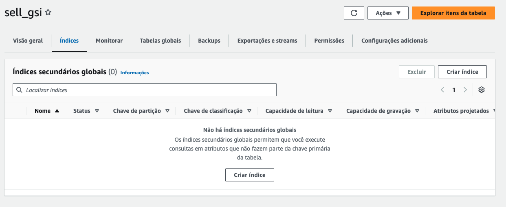
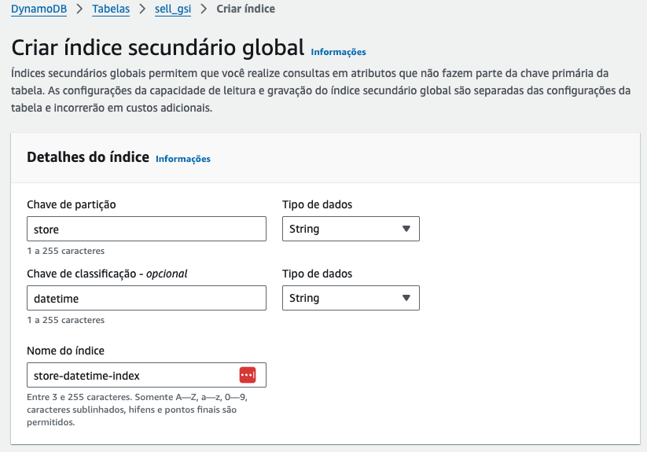
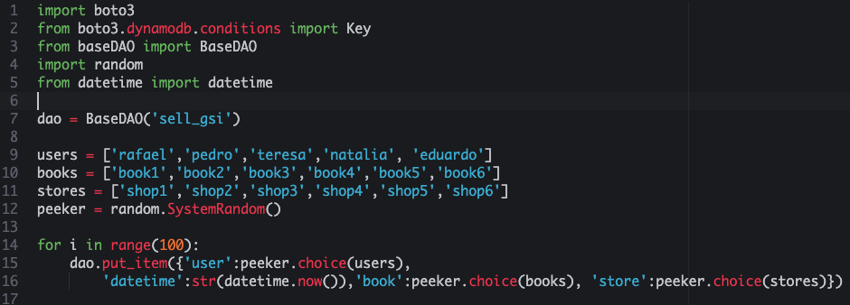
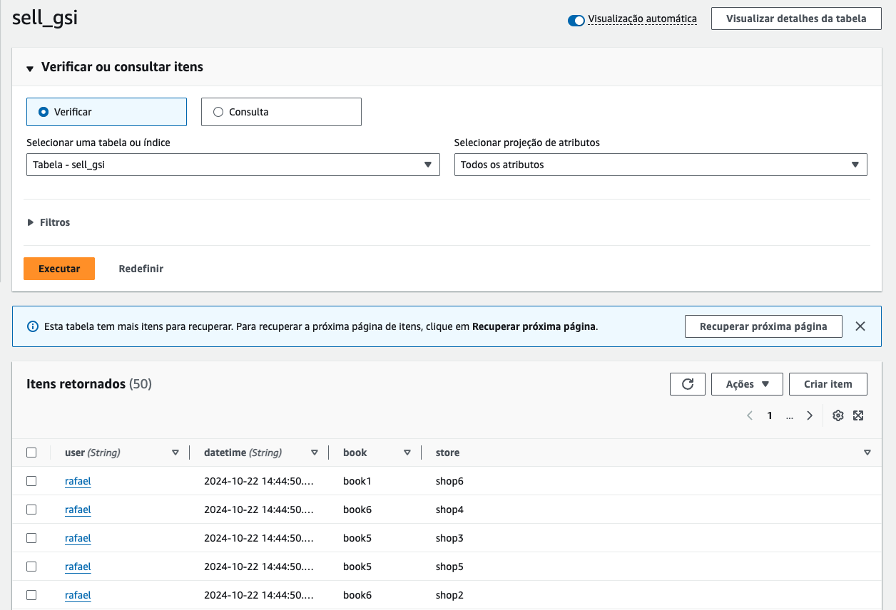
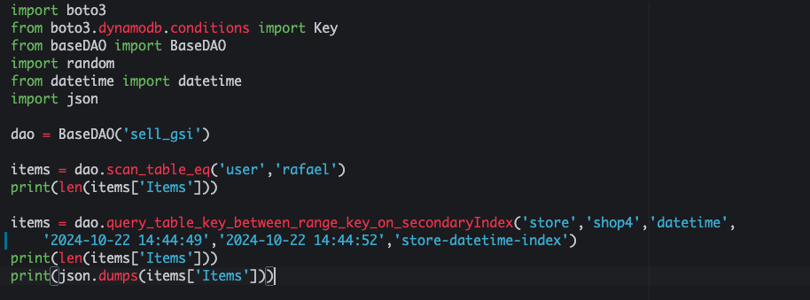

# 03.4 - Global Secondary Key

1. Acesse o [console do dynamoDB](https://us-east-1.console.aws.amazon.com/dynamodbv2/home?region=us-east-1#dashboard)
2. Crie uma table chamada 'sell_gsi' utilizando 'user' como PK e 'datetime' como SK. Mantenha as configurações padrão e crie a tabela.
3. Após criar a tabela, [acesse o painel](https://us-east-1.console.aws.amazon.com/dynamodbv2/home?region=us-east-1#table?name=sell_gsi&tab=overview) e vá até a aba 'Índices', e clique em 'Criar índice'.



4. Preencha como a imagem, e clique em 'Criar índice'. Esse processo pode demorar.
   1. Chave de partição: store
   2. Chave de classificação: datetime
   3. Nome do índice: store-datetime-index



<blockquote>
# Como Escolher a Capacidade de sua Chave Secundária Global no DynamoDB

Ao configurar uma **Índice Secundário Global (GSI)** no Amazon DynamoDB, é crucial considerar o provisionamento correto de capacidade para garantir o desempenho e evitar gargalos. O **Índice Secundário Global (GSI)** permite que você consulte dados usando chaves diferentes da chave primária da tabela, mas o uso de GSIs também exige uma gestão cuidadosa da capacidade.

## Considerações ao Escolher a Capacidade

### 1. **Provisionamento de Capacidade Independente**
Os GSIs possuem seu próprio provisionamento de capacidade de leitura e gravação, separados da tabela base. Isso significa que você precisa definir unidades de **Capacidade de Leitura (RCU)** e **Capacidade de Gravação (WCU)** específicas para o índice secundário, baseado nas suas previsões de uso.

### 2. **Volume de Operações no GSI**
Ao projetar a capacidade de um GSI, considere:
- **Leitura no GSI**: As operações de consulta que utilizam o GSI consomem as unidades de leitura do índice, e não da tabela base. Se você espera um alto volume de consultas no GSI, deve provisionar mais unidades de leitura para evitar limitações de throughput.
- **Gravação no GSI**: Cada vez que um item é escrito ou atualizado na tabela principal e afeta os atributos que o GSI está indexando, a gravação será replicada no índice. Isso consome unidades de gravação do GSI, portanto, se você tem muitas operações de escrita na tabela principal, precisará provisionar mais unidades de gravação no GSI.

### 3. **Operações Consistentes e Não Consistentes**
Assim como na tabela base, as leituras no GSI podem ser **fortemente consistentes** ou **eventualmente consistentes**. Leituras fortemente consistentes consumirão mais unidades de capacidade de leitura, e isso deve ser levado em consideração ao dimensionar a capacidade.

### 4. **Auto Scaling**
Habilitar o **Auto Scaling** pode ser uma solução eficaz para ajustar automaticamente a capacidade do GSI com base nas variações da carga de trabalho. Isso ajuda a gerenciar picos de tráfego sem precisar manualmente ajustar a capacidade provisionada.

## Boas Práticas

- **Monitorar o uso**: Utilize o CloudWatch para monitorar a taxa de consumo de capacidade do GSI e ajustar conforme necessário.
- **Testar a capacidade**: Realize testes de carga em seu GSI para determinar se a capacidade provisionada atende às necessidades de sua aplicação.
- **Auto Scaling**: Habilite o Auto Scaling para ajustar automaticamente as unidades de capacidade com base no uso real.

### Documentação Oficial
Para mais detalhes sobre o provisionamento de capacidade para Índices Secundários Globais, consulte a documentação oficial da AWS:
- [Amazon DynamoDB - Global Secondary Indexes](https://docs.aws.amazon.com/amazondynamodb/latest/developerguide/GSI.html?icmpid=docs_dynamodb_help_panel_hp_index_capacity#GSI.ThroughputConsiderations)

---

Ao seguir essas diretrizes, você pode otimizar o desempenho e garantir que sua aplicação DynamoDB utilizando GSIs tenha a capacidade necessária para lidar com a carga de trabalho esperada.
</blockquote>

5. De volta ao cloud9 acesse a pasta com os scripts a serem utilizados: `cd ~/environment/fiap-cloud-computing-tutorials/03-Dynamo-Base`
6. Abra o arquivo dynamo-GSI-1.py no IDE com o comando `c9 open dynamo-GSI-1.py`



7. Esse script irá popular de maneira randomica combinações dos objetos das listas users,stores e books. Execute o arquivo com o comando `python3 dynamo-GSI-1.py`. [Acessando a tabela 'sell_gsi'](https://us-east-1.console.aws.amazon.com/dynamodbv2/home?region=us-east-1#item-explorer?operation=SCAN&table=sell_gsi) no console do dynamoDB, você poderá ver os dados sendo inseridos.



8. Abra o arquivo dynamo-GSI-2.py no IDE com o comando `c9 open dynamo-GSI-2.py`
9. Altere o arquivo 'dynamo-GSI-2.py' para que fique como na imagem, escolhendo um invervalo valido na sua tabela sell_gsi de mais de um segundo para o usuario pesquisado



<blockquote>

### Explicação do Código

O código interage com uma tabela chamada **`sell_gsi`** no Amazon DynamoDB. Ele realiza duas operações principais: um **Scan** na tabela e uma **Query** em um **Índice Secundário Global (GSI)**. Vamos detalhar o funcionamento de cada parte e os resultados esperados.

### Instância do `BaseDAO`
```python
dao = BaseDAO('sell_gsi')
```
- Aqui, cria-se uma instância da classe `BaseDAO`, que provavelmente contém métodos para interagir com a tabela **`sell_gsi`** no DynamoDB. Essa classe facilita operações como **Scan**, **Query**, etc., na tabela e seus índices.

### Operação de Scan
```python
items = dao.scan_table_eq('user', 'rafael')
print(len(items['Items']))
```
- **`scan_table_eq('user', 'rafael')`**: Esse método realiza uma operação de **Scan** na tabela **`sell_gsi`** para buscar todos os itens onde o atributo **`user`** é igual a `'rafael'`. 
- O **Scan** examina todos os itens da tabela, independentemente de índices ou chaves primárias. Esse tipo de operação é mais custosa em termos de desempenho, especialmente em tabelas grandes, pois varre todos os registros.

#### Comportamento:
- A operação de **Scan** vai percorrer todos os itens da tabela **`sell_gsi`** e retornar apenas os itens onde o atributo **`user`** é igual a `'rafael'`.
  
#### Saída:
- **`len(items['Items'])`**: Exibe a quantidade de itens retornados pela operação de **Scan**.
  
Exemplo de saída:
```
3  # Exemplo de número de itens onde 'user' é 'rafael'
```

### Operação de Query com Índice Secundário
```python
items = dao.query_table_key_between_range_key_on_secondaryIndex('store', 'shop4', 'datetime', 
    '2024-10-22 14:44:49', '2024-10-22 14:44:52', 'store-datetime-index')
print(len(items['Items']))
print(json.dumps(items['Items']))
```
- **`query_table_key_between_range_key_on_secondaryIndex`**: Este método realiza uma **Query** (consulta) em um **Índice Secundário Global (GSI)** chamado **`store-datetime-index`**. Ele busca itens onde:
  - O valor da chave de partição **`store`** é igual a `'shop4'`.
  - O valor da chave de ordenação **`datetime`** está no intervalo entre `'2024-10-22 14:44:49'` e `'2024-10-22 14:44:52'`.
  
- A **Query** é mais eficiente que um **Scan**, pois ela usa a chave de partição (`store`) para localizar itens diretamente dentro de uma partição específica, e a chave de ordenação (`datetime`) para filtrar os resultados dentro dessa partição.

#### Comportamento:
- A **Query** vai buscar todos os itens no **índice secundário global** `'store-datetime-index'` onde:
  - O valor de **`store`** seja `'shop4'`.
  - O valor de **`datetime`** esteja entre `'2024-10-22 14:44:49'` e `'2024-10-22 14:44:52'`.

#### Saída:
- **`len(items['Items'])`**: Exibe a quantidade de itens retornados pela operação de **Query**.
- **`json.dumps(items['Items'])`**: Imprime os itens retornados no formato JSON, facilitando a visualização dos detalhes de cada item.

Exemplo de saída:
```
2  # Exemplo de número de itens encontrados
[
    {"store": "shop4", "datetime": "2024-10-22 14:44:50", "item": "book1", "price": 20},
    {"store": "shop4", "datetime": "2024-10-22 14:44:51", "item": "book2", "price": 15}
]
```

### Resumo

10. **Scan na Tabela Principal**:
   - A primeira operação realiza um **Scan** na tabela **`sell_gsi`**, buscando todos os itens onde o campo **`user`** é igual a `'rafael'`.
   - Essa operação percorre toda a tabela, o que pode ser mais lento e ineficiente em tabelas grandes.
   - A saída imprime a quantidade de itens onde o `user` é `'rafael'`.

11. **Query no Índice Secundário Global (GSI)**:
   - A segunda operação realiza uma **Query** no **índice secundário global** `'store-datetime-index'`.
   - A **Query** é mais eficiente que o **Scan**, pois usa a chave de partição (`store`) e a chave de ordenação (`datetime`) para filtrar os itens diretamente no índice.
   - A saída imprime a quantidade de itens encontrados e exibe seus detalhes em formato JSON, onde `store = 'shop4'` e `datetime` está entre `'2024-10-22 14:44:49'` e `'2024-10-22 14:44:52'`.
</blockquote>

12. dados. Execute o arquivo com o comando `python3 dynamo-GSI-2.py`
    

### Documentação
[https://docs.aws.amazon.com/pt_br/amazondynamodb/latest/developerguide/GSI.html](https://docs.aws.amazon.com/pt_br/amazondynamodb/latest/developerguide/GSI.html)
