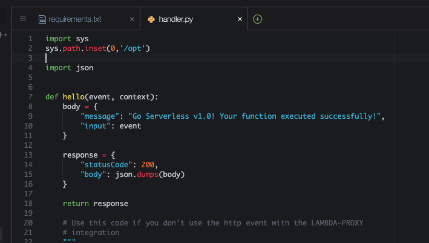

# Aula 02.2 - Lambda Layers


1. No terminal do IDE criado no cloud9 execute o comando `cd ~/environment/fiap-cloud-computing-tutorials/04\ -\ Lambda/02\ -\ Layers/` para entrar na pasta que fara este exercicio.

2. Iniciar o repositório de trabalho `sls create --template "aws-python3"`.
  
    

3. Crie um arquivo chamado requirements.txt com o conteúdo 'boto3' Crie o arquivo com o comando `c9 open requirements.txt`. Salve com CTRL+S.

      

<blockquote>

O arquivo **`requirements.txt`** é um arquivo padrão utilizado em projetos Python para listar as dependências (bibliotecas ou pacotes) que o projeto precisa para funcionar corretamente. Ele permite que as bibliotecas necessárias sejam instaladas de forma automática, garantindo que o ambiente de desenvolvimento ou de produção tenha as mesmas dependências que o projeto necessita.

### Função do **`requirements.txt`**

- **Definição de Dependências**: Ele lista os pacotes/bibliotecas que o projeto depende para funcionar. Cada linha do arquivo especifica um pacote que deve ser instalado.
- **Compatibilidade de Ambientes**: Ao compartilhar esse arquivo, você garante que quem clonar ou baixar o projeto pode instalar facilmente as mesmas bibliotecas e versões, mantendo a consistência entre ambientes de desenvolvimento, teste e produção.

### Conteúdo do **`requirements.txt`**:

No caso do seu arquivo, ele contém:

```
boto3
```

- **`boto3`**: É a biblioteca oficial da AWS para Python, usada para interagir com vários serviços da AWS, como S3, DynamoDB, Lambda, entre outros. 
  - **Boto3** é essencial para automatizar e integrar serviços da AWS em scripts ou aplicações Python. Ele permite que você programe suas funções Lambda, manipule buckets S3, ou faça consultas a bancos de dados DynamoDB diretamente do seu código Python.

### Resumo

Neste caso, o **`requirements.txt`** especifica que o projeto depende da biblioteca **Boto3**. Isso significa que qualquer pessoa ou sistema que executar este projeto Python precisará ter a biblioteca **Boto3** instalada para que o código funcione corretamente, especialmente se ele estiver interagindo com serviços AWS.

</blockquote>

4. Execute o comando no terminal `pip3 install virtualenv && python3 -m venv ~/venv` para criar um ambiente virtual python e pode baixar as dependencias sem conflitar com nenhuma dependecia já baixada.

<blockquote>

O comando **`pip3 install virtualenv && python3 -m venv ~/venv`** realiza duas operações principais: a instalação do pacote **`virtualenv`** com o **pip3** e a criação de um ambiente virtual Python usando o **venv**. Vamos dividir a explicação em duas partes para entender melhor o que cada parte faz:

### 1. **`pip3 install virtualenv`**

Este comando instala o pacote **`virtualenv`** usando o **pip3**, que é o gerenciador de pacotes para Python 3.

- **`pip3`**: O gerenciador de pacotes do Python 3. Ele é usado para instalar pacotes e bibliotecas Python no sistema.
- **`install`**: O comando que indica que estamos instalando um pacote.
- **`virtualenv`**: É o nome do pacote que será instalado. O **virtualenv** é uma ferramenta que permite criar ambientes isolados para projetos Python. Cada ambiente virtual pode ter suas próprias dependências e versões de bibliotecas, evitando conflitos entre projetos.

#### O que é o `virtualenv`?
- **virtualenv** é uma ferramenta que cria ambientes Python isolados, onde cada ambiente pode ter suas próprias versões de bibliotecas e dependências, sem interferir no ambiente global do Python instalado no sistema. Isso é útil quando você está trabalhando em diferentes projetos que exigem diferentes versões de bibliotecas.

### 2. **`python3 -m venv ~/venv`**

Este comando utiliza o módulo **`venv`** (que vem embutido no Python 3) para criar um **ambiente virtual** Python. Aqui está o detalhamento:

- **`python3`**: Chama o interpretador Python 3. É utilizado para executar comandos ou scripts Python.
- **`-m venv`**: O argumento **`-m`** especifica que estamos executando o módulo **`venv`**, que cria um ambiente virtual.
- **`~/venv`**: Este é o caminho onde o ambiente virtual será criado. **`~/venv`** indica que o ambiente virtual será criado no diretório pessoal do usuário, em uma pasta chamada **`venv`**.

#### O que é o `venv`?
- **`venv`** é um módulo embutido no Python 3 para criar ambientes virtuais. Ele é semelhante ao **virtualenv**, mas vem por padrão no Python 3, tornando desnecessária a instalação de pacotes adicionais.
- Ao criar um ambiente virtual com **`venv`**, um conjunto isolado de diretórios é criado, contendo seu próprio interpretador Python e suas próprias dependências.

### Comportamento Geral do Comando

Quando você executa o comando **`pip3 install virtualenv && python3 -m venv ~/venv`**, o que acontece é:

1. O **`virtualenv`** é instalado no seu sistema usando o **pip3**.
2. Um ambiente virtual Python é criado no diretório **`~/venv`** (na sua pasta pessoal), usando o **`venv`** embutido no Python 3.
.
</blockquote>

5. Execute o comando no terminal `source ~/venv/bin/activate` para ativar o ambiente virtual criado no passo anterior

<blockquote>

O comando **`source ~/venv/bin/activate`** é utilizado para **ativar um ambiente virtual** Python que foi criado previamente com o módulo **`venv`**. O ambiente virtual é uma cópia isolada do ambiente Python do sistema, onde você pode instalar pacotes e bibliotecas sem afetar o ambiente Python global. Ao ativar o ambiente virtual, ele muda o contexto do terminal, passando a utilizar o Python e as bibliotecas instaladas dentro do diretório **`~/venv`** (neste caso).

Quando o ambiente virtual está ativado, o prompt do terminal geralmente exibe o nome do ambiente (por exemplo, **`(venv)`**), indicando que você está trabalhando dentro dele. Durante esse tempo, todos os pacotes instalados com **`pip`** serão armazenados no ambiente virtual, em vez de serem instalados globalmente no sistema. Para desativar o ambiente e retornar ao ambiente global do sistema, basta usar o comando **`deactivate`**.

</blockquote>

6. Crie uma pasta chamada `layer` utilizando o comando no terminal `mkdir layer`.
7. Execute o comando `pip3 install -r requirements.txt -t layer` para instalar todas as dependencias listadas no arquivo requirements.txt dentro da pasta layer.
    


<blockquote>

O comando **`pip3 install -r requirements.txt -t layer`** é utilizado para instalar todas as dependências listadas no arquivo **`requirements.txt`** em um diretório específico, neste caso, o diretório **`layer`**. Vamos detalhar o funcionamento de cada parte do comando:

### Explicação Detalhada

- **`pip3`**: Este é o gerenciador de pacotes para Python 3. Ele é usado para instalar, atualizar e gerenciar pacotes e bibliotecas Python.
  
- **`install`**: Esse é o comando que instrui o **pip3** a instalar os pacotes especificados.

- **`-r requirements.txt`**: A flag **`-r`** indica que o **pip** deve ler o arquivo **`requirements.txt`** para descobrir quais pacotes precisam ser instalados. O **`requirements.txt`** contém uma lista de pacotes e suas versões, garantindo que todas as dependências necessárias para o projeto sejam instaladas corretamente.

- **`-t layer`**: A flag **`-t`** especifica o **diretório de destino** onde os pacotes instalados serão colocados. Neste caso, o diretório **`layer`** é o local onde as bibliotecas serão instaladas. Isso é útil para controlar onde as dependências devem ser armazenadas, em vez de instalá-las no ambiente global ou no ambiente virtual.

### Finalidade do Comando

Este comando é particularmente útil em ambientes de **AWS Lambda** onde você precisa criar uma [Lambda Layer](https://docs.aws.amazon.com/pt_br/lambda/latest/dg/chapter-layers.html). Ao instalar as dependências no diretório **`layer`**, você pode empacotar esse diretório e enviá-lo como uma **camada (layer)** para o AWS Lambda. Isso permite reutilizar bibliotecas em várias funções Lambda, otimizando o tamanho do código e o processo de deploy.

</blockquote>

8. Execute o comando `c9 open handler.py` e altere o topo do arquivo handler.py para que fique como na imagem:

   

<blockquote>

### 1. **Importa o Módulo `sys`**:
- O módulo **`sys`** em Python fornece acesso a várias variáveis e funções que interagem com o interpretador Python. Um dos principais atributos do módulo **`sys`** é a lista **`sys.path`**, que contém os diretórios onde o Python busca por módulos para importar.

### 2. **Modifica a Lista `sys.path`**:
- Aqui, o código insere o caminho **`/opt`** na **primeira posição** da lista **`sys.path`**.
- **`sys.path`** é uma lista de diretórios que o Python usa para procurar módulos e pacotes quando um **`import`** é executado.
- Ao usar **`insert(0, '/opt')`**, o diretório **`/opt`** é adicionado ao início da lista de caminhos. Isso significa que, a partir de agora, quando o Python tentar importar um módulo, ele vai primeiro procurar no diretório **`/opt`** antes de verificar outros diretórios no **`sys.path`** (como o diretório atual, pacotes do sistema, etc.).

### Finalidade
A principal razão para adicionar **`/opt`** ao **`sys.path`** é que você pode ter bibliotecas ou módulos personalizados localizados no diretório **`/opt`**, que normalmente não é parte do caminho padrão de pesquisa do Python. Isso é comum em ambientes como o **AWS Lambda**, onde as dependências podem ser colocadas em **`/opt`** quando você usa **Lambda Layers**. Ao modificar o **`sys.path`**, você garante que o Python pode localizar e importar esses módulos corretamente.

### Em Resumo:
Este código modifica o caminho de pesquisa do Python para que o diretório **`/opt`** seja priorizado na busca por módulos a serem importados. Isso é útil para acessar bibliotecas ou pacotes que foram instalados ou disponibilizados fora dos diretórios padrões de Python.
</blockquote>

9. Execute o comando `c9 open serverless.yml`, No serverless.yml deixe o arquivo como na imagem, podem apagar todo o conteudo existente:
 
   

<blockquote>

Este arquivo **`serverless.yml`** define a configuração de um serviço serverless usando o **Serverless Framework**, com foco em funções Lambda e a utilização de **layers** (camadas). Aqui está uma explicação detalhada de cada parte do arquivo:

### 1. **Package Section: Excluir Arquivos**

- **`package`**: Esta seção controla quais arquivos ou diretórios serão incluídos ou excluídos no pacote final quando a aplicação é implantada.
- **`exclude`**: Especifica arquivos ou diretórios que devem ser excluídos do pacote de implantação.
  - **`layer/**`**: Aqui, a diretiva exclui o diretório **`layer/`** e todo o seu conteúdo. Isso significa que o conteúdo desse diretório não será incluído diretamente no pacote de implantação do Lambda. Isso é importante, pois o conteúdo do diretório **`layer/`** será tratado como uma camada separada (veja a próxima seção), e não como parte da função Lambda principal.

### 2. **Layers Section: Definição de uma Layer (Camada)**

- **`layers`**: Essa seção define uma ou mais **camadas (layers)** para o Lambda. Layers são uma maneira de compartilhar código ou dependências entre diferentes funções Lambda, evitando duplicação de código.
- **`LayerDependencies`**: Este é o nome da camada. Ela é identificada como **`LayerDependencies`**, o que pode ser referenciado posteriormente pelas funções Lambda.
  - **`path: layer`**: Define o diretório onde o conteúdo da camada está localizado. Nesse caso, a camada está no diretório **`layer/`**, que contém as bibliotecas ou dependências que serão incluídas na layer.
  - **`description: "Learning Layers"`**: Uma descrição opcional da camada, que é útil para documentação e entendimento do propósito da layer.

### 3. **Functions Section: Definição da Função Lambda**

- **`functions`**: Esta seção define as funções Lambda que serão implantadas.
- **`hello`**: O nome da função Lambda. Aqui, a função é chamada de **`hello`**.
  - **`handler: handler.hello`**: Define o caminho do arquivo e da função que serão executados. Aqui, o arquivo **`handler.py`** contém a função **`hello`**, que será invocada quando a função Lambda for acionada.
  - **`layers:`**: Especifica as **layers** que serão associadas a essa função Lambda. Neste caso, a função está associada à camada **`LayerDependencies`**. O **`{Ref: LayerDependenciesLambdaLayer}`** é uma referência ao recurso criado para a layer no CloudFormation. O Serverless Framework gerencia automaticamente essa referência para que a camada correta seja atribuída à função.

  O **`{Ref: LayerDependenciesLambdaLayer}`** utiliza a função **Ref** do **AWS CloudFormation**, que recupera o identificador da camada gerada automaticamente pelo CloudFormation durante a implantação. Esse identificador é associado à função **`hello`**, de forma que ela utilize as bibliotecas e dependências definidas na camada **`LayerDependencies`**.

### Resumo

- **Exclusão de Diretório `layer/`**: O conteúdo do diretório **`layer/`** não será incluído diretamente no pacote da função Lambda, pois será tratado como uma **camada separada**.
- **Definição de uma Layer**: O diretório **`layer/`** é definido como uma camada separada chamada **`LayerDependencies`**, que pode conter dependências (como pacotes Python, por exemplo).
- **Uso da Layer pela Função Lambda**: A função Lambda **`hello`** usa essa camada ao referenciá-la com **`{Ref: LayerDependenciesLambdaLayer}`**, garantindo que as dependências da camada estejam disponíveis para a função.

Essa configuração é útil quando você deseja separar dependências comuns ou bibliotecas compartilhadas em uma camada, tornando a implantação mais eficiente e reduzindo duplicação de código entre várias funções Lambda.

</blockquote>

10. Fazer deploy da função criada `sls deploy`

    

<blockquote>

Quando utilizamos **layers** no **Serverless Framework**, o comando **`sls deploy`** se comporta de maneira um pouco diferente em relação à implantação tradicional de funções Lambda sem layers. A diferença principal está na forma como o framework trata as **camadas (layers)** e o código da função separadamente:

### Diferenças ao Usar Layers com **`sls deploy`**:

1. **Empacotamento de Layers Separado**:
   - Ao usar **layers**, o **Serverless Framework** empacota o conteúdo da layer (dependências ou código reutilizável) **separadamente** da função Lambda. Isso significa que as bibliotecas ou arquivos incluídos na camada são enviados como uma **entidade distinta**, ao invés de serem incorporados diretamente ao pacote da função Lambda.
   
2. **Reutilização de Layers**:
   - Se você fizer o deploy de uma função Lambda que utiliza uma layer, e a layer já estiver implantada (e não tiver sido modificada), o Serverless Framework **não a empacota ou envia novamente**. Ele simplesmente referencia a layer já existente. Isso resulta em um deploy mais rápido, pois apenas as alterações na função são empacotadas e enviadas.
   - Por outro lado, se houver mudanças na camada (por exemplo, novas dependências adicionadas), o **Serverless Framework** irá recriar a layer e enviar o pacote atualizado durante o **`sls deploy`**.

### Vantagem:
- **Desempenho Otimizado**: Com **layers**, você reduz o tamanho dos pacotes de implantação das funções Lambda e evita a duplicação de bibliotecas entre diferentes funções, resultando em **deploys mais rápidos** e menores.

Em resumo, quando você usa layers, o **`sls deploy`** trata as camadas como componentes separados, e isso pode melhorar a eficiência do processo de implantação ao evitar pacotes desnecessariamente grandes e reutilizar layers já implantadas.

</blockquote>

11. Em uma outra aba do seu navegavor abra o [console da AWS no serviço Lambda](https://us-east-1.console.aws.amazon.com/lambda/home?region=us-east-1#/functions).

12. Note a função que acabou de criar já esta no painel, para ver a layer clique em "camadas" no menu lateral da página

    

13. Para visualizar as camadas(Layers) criadas abra essa outra [janela](https://us-east-1.console.aws.amazon.com/lambda/home?region=us-east-1#/layers).

    

14. Para invocar remotamente a função utilize o comando `sls invoke -f hello` no terminal do cloud 9
  
  

15. destrua a função feita `sls remove`