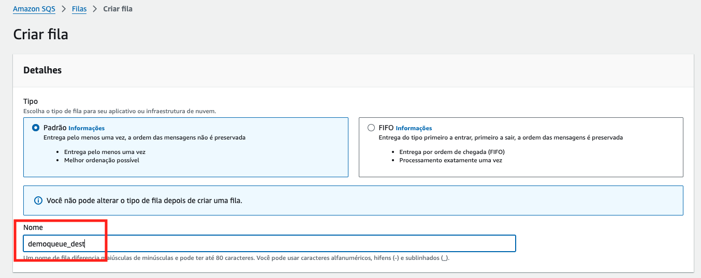

# Aula 04.1 - Standart Queue

### Criando a fila sqs

1. [Crie uma fila](https://us-east-1.console.aws.amazon.com/sqs/v3/home?region=us-east-1#/create-queue) no sqs colocando o nome 'demoqueue', deixe os valores default e clique em 'Criar Fila'
    
    

    

2. Deixe essa aba aberta, será necessária para um passo adiante.

<details>
<summary> 

**Explicação**

</summary>

<blockquote>

# Interação com Filas Amazon SQS via URL

A Amazon Simple Queue Service (Amazon SQS) fornece URLs exclusivas para cada fila criada. Essas URLs são usadas para interagir diretamente com as filas e são necessárias para realizar operações, como enviar e receber mensagens. A URL da fila serve como um identificador exclusivo para acessar a fila.

## Formato da URL da Fila
    A URL de uma fila geralmente segue este formato:
    ```
    https://sqs.<região>.amazonaws.com/<ID_da_conta>/<nome_da_fila>
    ```

- `<região>`: Representa a região AWS onde a fila está localizada (ex.: `us-east-1`).
- `<ID_da_conta>`: O ID da conta AWS onde a fila foi criada.
- `<nome_da_fila>`: O nome da fila criado pelo usuário.

## Utilização da URL para Operações

### Enviar Mensagens
Para enviar mensagens para uma fila, utiliza-se a URL da fila como ponto de acesso para o endpoint de envio (`SendMessage`).

### Receber Mensagens
Para receber mensagens de uma fila, a URL é usada no endpoint de recebimento (`ReceiveMessage`), permitindo que aplicações façam polling na fila.

### Excluir Mensagens
Ao processar mensagens, a URL da fila é usada na chamada de exclusão (`DeleteMessage`) para remover a mensagem da fila, garantindo que ela não seja processada novamente.

### Exemplo de Uso
Ao configurar clientes SQS nas SDKs da AWS, basta passar a URL da fila para o método de operações, conforme o exemplo:

```python
    # Exemplo em Python usando boto3
    import boto3

    # Criando o cliente SQS
    sqs = boto3.client('sqs')

    # Definindo a URL da fila
    queue_url = 'https://sqs.us-east-1.amazonaws.com/123456789012/minha-fila'

    # Enviando uma mensagem
    sqs.send_message(QueueUrl=queue_url, MessageBody='Olá, SQS!')

```

## Conclusão
As URLs de filas Amazon SQS são componentes essenciais para identificar e interagir com filas na AWS, permitindo uma integração direta e segura com a fila específica através de operações padrão oferecidas pela SQS.

</blockquote>

</details>

### Enviando dados para a fila

3. No terminal do CLoud 9 IDE criado no cloud9 execute o comando `cd ~/environment/fiap-cloud-computing-tutorials/05-SQS/01\ -\ Standard\ Queue/` para entrar na pasta que fara este exercicio.
4. Abra o arquivo put.py com o comando `c9 open put.py`
5. Volte a aba do SQS e copie a URL da fila que criou nos passos anteriores
    
    
    
6. Altere o arquivo put.py adicionando a URL da fila do sqs que criou nos passos anteriores

    

7. Execute os comandos abaixo para garantir que esta em um ambiente virtual do python com as dependencias necessárias para executar o execício:

   ``` shell
   pip3 install virtualenv && python3 -m venv ~/venv
   source ~/venv/bin/activate
   pip3 install boto3
   sudo npm i serverless@3.39.0 -g
   ```

8. Execute o comando `python3 put.py` no terminal para colocar 3000 mensagens na fila. Verifique no [console](https://us-east-1.console.aws.amazon.com/sqs/v3/home?region=us-east-1#/queues) o resultado do comando.


<details>
<summary> 

**Explicação**

</summary>

<blockquote>

#**Explicação** do Código

```python
from sqsHandler import SqsHandler
```
- Este comando importa a classe **`SqsHandler`** de um módulo chamado **`sqsHandler`**. A **`SqsHandler`** é provavelmente uma classe personalizada que encapsula a lógica de interação com o **Amazon SQS** (como envio de mensagens em lote, recebimento de mensagens, etc.).

```python
mensagens = []
for num in range(3000):
    mensagens.append({'Id': str(num), 'MessageBody': str(num)})
```
- Cria uma lista chamada **`mensagens`** que armazenará **3000 mensagens** a serem enviadas à fila SQS.
- O laço **`for`** itera de **0** a **2999**, e em cada iteração adiciona um dicionário à lista **`mensagens`**. Cada dicionário representa uma mensagem individual no formato exigido pelo SQS, com:
  - **`Id`**: Um identificador único da mensagem (aqui, usando o valor de `num` como string).
  - **`MessageBody`**: O corpo da mensagem, que também é o valor de `num` convertido para string.

```python
splitMsg = [mensagens[x:x+10] for x in range(0, len(mensagens), 10)]
```
- Este comando usa uma **list comprehension** para dividir a lista **`mensagens`** em **sublistas de até 10 mensagens**.
- Como o **Amazon SQS** permite o envio de no máximo **10 mensagens por vez** em uma operação de envio em lote, este código divide a lista original **`mensagens`** em sublistas de tamanho 10.
- **`splitMsg`** conterá várias sublistas de mensagens, cada uma com no máximo 10 mensagens.

```python
sqs = SqsHandler('<url da sua fila>')
```
- Aqui, uma instância da classe **`SqsHandler`** é criada e configurada para apontar para a URL da fila SQS desejada. A URL da fila deve ser fornecida no lugar de **`<url da sua fila>`**.
- A **`SqsHandler`** provavelmente encapsula a lógica de envio e manipulação de mensagens SQS, incluindo operações em lote.

```python
for lista in splitMsg:
    print(type(lista))
    print(str(lista))
    sqs.sendBatch(lista)
```
- Este laço **`for`** itera sobre cada sublista **`lista`** em **`splitMsg`**.
- **`print(type(lista))`** e **`print(str(lista))`**: Exibem o tipo e o conteúdo de cada sublista (ou lote de mensagens). Cada sublista tem o tipo **`list`** e contém até 10 dicionários (cada um representando uma mensagem).
- **`sqs.sendBatch(lista)`**: Envia o lote de mensagens **`lista`** para a fila SQS utilizando o método **`sendBatch`** da instância **`SqsHandler`**. Esse método provavelmente é configurado para enviar um lote de mensagens (de até 10) para a fila SQS usando a API `send_message_batch` do **Boto3** (SDK da AWS para Python).

### Resumo

Este código cria **3000 mensagens**, divide-as em lotes de até **10 mensagens cada** (como exigido pelo SQS para envios em lote), e envia cada lote para a fila SQS usando a **`SqsHandler`**. Essa abordagem é eficiente para enviar grandes quantidades de mensagens sem exceder o limite de mensagens em uma operação em lote do SQS.

</blockquote>

</details>

### Consumindo SQS

9. [Crie mais uma fila](https://us-east-1.console.aws.amazon.com/sqs/v3/home?region=us-east-1#/create-queue) sqs utilizando o mesmo procedimento do exercicio anterior com o mesmo nome da anterior com o sulfixo '_dest', ficará `demoqueue_dest`



10. Execute o comando no terminal do cloud 9 `sls create --template "aws-python3"`
11. Abra o arquivo serverless.yml com o comando `c9 open serverless.yml`
12. Altere o arquivo 'serverless.yml' e coloque o seguinte conteudo, não esqueça de preencher as duas URLs das filas como descrito:


<details>
<summary> 

**Explicação**

</summary>

<blockquote>

O arquivo **`serverless.yml`** define a configuração de um serviço no **Serverless Framework** para uma aplicação em **AWS Lambda** que utiliza Python 3.11 como ambiente de execução e interage com duas filas **SQS**. Vamos analisar cada seção em detalhes.

### 1. Nome do Serviço e Versão do Framework

```yaml
service: service-01-standard-queue
frameworkVersion: '3'
```

- **`service`**: Define o nome do serviço. Neste caso, é chamado **`service-01-standard-queue`**, servindo como identificador para os recursos criados na AWS (como o CloudFormation Stack).
- **`frameworkVersion`**: Especifica a versão do Serverless Framework que será usada. Aqui, a versão **3** garante que o projeto siga as sintaxes e funcionalidades dessa versão específica.

### 2. Provedor de Nuvem e Configurações

```yaml
provider:
  name: aws
  runtime: python3.11
  memorySize: 128
  region: 'us-east-1'
  timeout: 300
  iam:
    role: !Sub arn:aws:iam::${AWS::AccountId}:role/LabRole
  environment:
    sqs_url: !Sub https://sqs.${AWS::Region}.amazonaws.com/${AWS::AccountId}/demoqueue
    sqs_url_dest: !Sub https://sqs.${AWS::Region}.amazonaws.com/${AWS::AccountId}/demoqueue_dest
```

- **`provider`**: Define o provedor de nuvem para o serviço, que neste caso é a **AWS**.

  - **`name: aws`**: Especifica a AWS como provedor.
  
  - **`runtime: python3.11`**: Define o ambiente de execução das funções Lambda como **Python 3.11**.
  
  - **`memorySize: 128`**: Define a quantidade de memória (em MB) atribuída a cada execução da função Lambda. Aqui, foi configurada com o mínimo de 128 MB, o que afeta o custo e desempenho da função.

  - **`region: 'us-east-1'`**: Define a região da AWS onde os recursos serão implantados. Neste caso, a região é **`us-east-1`** (Virgínia do Norte).

  - **`timeout: 300`**: Define o tempo máximo de execução da função Lambda em segundos (5 minutos), após o qual a função será interrompida automaticamente caso não tenha terminado.

  - **`iam`**:
    - **`role`**: Especifica a **IAM Role** que será usada para essa função Lambda. Aqui, a role é referenciada por meio do comando **`!Sub`**, que substitui variáveis na string.
    - **`!Sub arn:aws:iam::${AWS::AccountId}:role/LabRole`**: O **`!Sub`** (substituição) é uma função do **CloudFormation** que injeta o ID da conta AWS atual na variável **`${AWS::AccountId}`**, resultando no ARN correto para a **LabRole**. Como você está utilizando uma conta do **AWS Academy** onde a criação de IAM Roles é restrita, a **LabRole** já existente é referenciada diretamente.

  - **`environment`**:
    - Define variáveis de ambiente para a função Lambda, acessíveis durante a execução.
    - **`sqs_url`**: Armazena a URL da fila SQS de origem chamada **`demoqueue`**. O **`!Sub`** injeta a região da AWS atual (**`${AWS::Region}`**) e o ID da conta (**`${AWS::AccountId}`**) na URL da fila.
    - **`sqs_url_dest`**: Armazena a URL de uma fila SQS de destino chamada **`demoqueue_dest`**, seguindo o mesmo padrão de substituição da variável.

### 3. Definição das Funções

```yaml
functions:
  hello:
    handler: handler.hello
```

- **`functions`**: Esta seção define as funções Lambda que serão implantadas com o serviço.

  - **`hello`**: Nome da função Lambda. Aqui, a função é chamada **`hello`**.
  
    - **`handler: handler.hello`**: Define o caminho do arquivo e da função que será executada. O arquivo é **`handler.py`**, e a função **`hello`** dentro desse arquivo será chamada quando a função Lambda for invocada.

### Resumo do Funcionamento

Este arquivo **`serverless.yml`** configura um serviço na AWS que inclui uma função Lambda chamada **`hello`**. Esta função é configurada para interagir com duas filas SQS (uma de origem e uma de destino), cujas URLs são passadas como variáveis de ambiente para a função Lambda. Ao configurar uma **IAM Role** já existente (**LabRole**), evita-se a criação de novas permissões, algo necessário devido às restrições de criação de roles em contas do **AWS Academy**. O uso do **`!Sub`** permite referenciar dinamicamente a região e a conta AWS, garantindo que as URLs e permissões estejam corretas.


</blockquote>

</details>


13. Altere o arquivo 'handler.py' deixando o conteúdo identico ao da imagem abaixo. O abra com o seguinte comando `c9 open handler.py`


<details>
<summary> 

**Explicação**

</summary>

<blockquote>

Este código em Python manipula duas filas **Amazon SQS** (Simple Queue Service), utilizando uma classe personalizada chamada **`SqsHandler`** e um módulo **`Variables`** para obter as URLs das filas. Ele lê mensagens de uma fila de origem, processa cada mensagem e a envia para uma fila de destino, deletando-a da fila de origem após o envio.

### Explicação do Código

```python
from sqsHandler import SqsHandler
from env import Variables
import json
```

- **`from sqsHandler import SqsHandler`**: Importa a classe **`SqsHandler`**, que é uma classe personalizada que encapsula métodos para interagir com o **SQS** (como envio, recebimento e exclusão de mensagens). 
- **`from env import Variables`**: Importa a classe **`Variables`**, que provavelmente fornece um método para acessar variáveis de ambiente, incluindo as URLs das filas de origem e destino.
- **`import json`**: Importa o módulo **`json`**, usado para serializar e desserializar mensagens em JSON, facilitando o processamento e envio das mensagens entre filas.

### Função `handler`

```python
def handler(event, context):
```
- A função **`handler`** é o ponto de entrada da função Lambda, e recebe dois parâmetros:
  - **`event`**: Contém dados sobre o evento que acionou a função Lambda.
  - **`context`**: Contém informações sobre o contexto de execução da função (não utilizado diretamente neste código).

### Instanciação das Variáveis e Filas SQS

```python
    env = Variables()
    sqs = SqsHandler(env.get_sqs_url())
    sqs_dest = SqsHandler(env.get_sqs_url_dest())
```

- **`env = Variables()`**: Cria uma instância da classe **`Variables`** para acessar as variáveis de ambiente.
- **`sqs = SqsHandler(env.get_sqs_url())`**: Instancia um objeto **`sqs`** para interagir com a fila de origem, cuja URL é obtida usando **`env.get_sqs_url()`**.
- **`sqs_dest = SqsHandler(env.get_sqs_url_dest())`**: Instancia um objeto **`sqs_dest`** para interagir com a fila de destino, cuja URL é obtida usando **`env.get_sqs_url_dest()`**.

### Laço de Processamento das Mensagens

```python
    for i in range(100):
        msgs = sqs.getMessage(10)
        print(json.dumps(msgs))
        
        if 'Messages' not in msgs:
            break
        if len(msgs['Messages']) == 0:
            break
```

- **`for i in range(100):`**: Define um laço para processar mensagens até 100 vezes, garantindo que o código não execute indefinidamente caso haja mensagens contínuas.
- **`msgs = sqs.getMessage(10)`**: Chama o método **`getMessage`** da instância **`sqs`** (fila de origem), tentando obter até **10 mensagens** de uma vez. O valor `10` indica o máximo de mensagens que o SQS permite em uma única chamada.
- **`print(json.dumps(msgs))`**: Exibe as mensagens recebidas em formato JSON para monitoramento e depuração.
- **Condições de Interrupção (`break`)**:
  - **`if 'Messages' not in msgs`**: Interrompe o laço se não houver uma chave **`Messages`** na resposta, indicando que não há mensagens disponíveis.
  - **`if len(msgs['Messages']) == 0`**: Interrompe o laço se a lista de mensagens estiver vazia, o que confirma que não há mais mensagens a serem processadas.

### Processamento de Cada Mensagem

```python
        for message in msgs['Messages']:
            sqs_dest.send(json.dumps(message['Body']))
            sqs.deleteMessage(message['ReceiptHandle'])
```

- **`for message in msgs['Messages']:`**: Itera sobre cada mensagem dentro da lista **`Messages`** retornada pela fila SQS de origem.
- **`sqs_dest.send(json.dumps(message['Body']))`**: 
  - Converte o **conteúdo da mensagem** (`message['Body']`) em JSON e envia para a **fila de destino** usando o método **`send`** da instância **`sqs_dest`**.
- **`sqs.deleteMessage(message['ReceiptHandle'])`**:
  - Após enviar a mensagem para a fila de destino, o código a exclui da fila de origem para evitar o reprocessamento. 
  - O método **`deleteMessage`** usa o **`ReceiptHandle`**, que é um identificador único retornado quando a mensagem é recebida, necessário para deletar a mensagem do SQS.

### Resumo do Funcionamento

1. **Leitura de Mensagens**: A função lê até 10 mensagens por vez da fila de origem (repetindo até 100 vezes ou até que as mensagens acabem).
2. **Envio para Fila de Destino**: Cada mensagem é enviada para a fila de destino.
3. **Remoção da Fila de Origem**: Após o envio, a mensagem é excluída da fila de origem.

Este código permite um **processamento em lote** de mensagens entre duas filas SQS, garantindo que as mensagens sejam transferidas e processadas de maneira eficiente e sem duplicação.

</blockquote>

</details>

14. rode o comando `sls deploy` no terminal para criar o lambda
15. Para execução do lambda rode o comando `sls invoke -l -f hello` no terminal para invocar a função lambda récem criada que irá consumir as mensagens da fila e enviar para a fila de destino.
16. Enquando espera o comando terminar pode observar no painel do SQS as mensagens se movendo a cada atualização manual pelo canto direito superior. Lembre que cada execução move 1000 por definição no código. [Link para painel SQS](https://console.aws.amazon.com/sqs/v2/home?region=us-east-1#/queues)
    
    

<details>
<summary> 

**Explicação**

</summary>

<blockquote>

No Amazon SQS, mensagens com status **"em trânsito"** (ou **"in-flight"**) são aquelas que foram recuperadas por um consumidor (ou seja, foram lidas da fila) mas ainda não foram excluídas ou cujo tempo de visibilidade (Visibility Timeout) não expirou. Esse conceito de "mensagem em trânsito" é importante para garantir que as mensagens processadas por um consumidor não sejam visíveis para outros consumidores até que o processamento esteja completo.

### Como Funcionam as Mensagens "Em Trânsito"

1. **Recepção e Visibilidade Temporária**:
   - Quando uma mensagem é lida por um consumidor usando, por exemplo, o método **`ReceiveMessage`**, essa mensagem é temporariamente **removida da fila** e fica invisível para outros consumidores. Essa invisibilidade temporária é determinada pelo **Visibility Timeout** da mensagem.
   - Durante o **Visibility Timeout**, a mensagem é considerada **"em trânsito"**, pois está sendo processada pelo consumidor atual.

2. **Tempo de Visibilidade e Reaparecimento na Fila**:
   - Se o consumidor finaliza o processamento e exclui a mensagem antes que o **Visibility Timeout** expire, a mensagem é removida da fila definitivamente.
   - Caso o tempo de visibilidade expire antes da exclusão, a mensagem reaparece na fila e estará disponível para que outros consumidores a processem novamente. Isso garante que mensagens não processadas completamente possam ser reatribuídas.

3. **Contagem de Mensagens "Em Trânsito"**:
   - O Amazon SQS mantém uma contagem do número de mensagens que estão em trânsito, disponível através do métrico **ApproximateNumberOfMessagesNotVisible** no **Amazon CloudWatch**. Esse valor representa uma estimativa do total de mensagens que estão invisíveis devido ao processamento ativo ou ao tempo de visibilidade.
   - Essa contagem ajuda a monitorar quantas mensagens estão sendo processadas ao mesmo tempo e pode indicar um acúmulo de mensagens caso o valor seja alto, sugerindo a necessidade de ajustar o tempo de visibilidade ou a quantidade de consumidores para processar as mensagens de forma mais eficaz.

Para mais informações, consulte a [documentação oficial do Amazon SQS sobre o Tempo de Visibilidade](https://docs.aws.amazon.com/pt_br/AWSSimpleQueueService/latest/SQSDeveloperGuide/sqs-visibility-timeout.html).

### Resumo

As mensagens "em trânsito" no SQS representam um mecanismo importante para garantir o processamento único de mensagens, minimizando a duplicação e permitindo o reprocessamento caso o tempo de visibilidade expire sem que a mensagem seja excluída. A contagem dessas mensagens em trânsito permite aos desenvolvedores e administradores monitorar a fila e otimizar a entrega e o consumo das mensagens.

</blockquote>

</details>

17. Para zerar as mensagens da fila de destino execute o comando `sls invoke -l -f sqsHandler` mais 2 vezes. Cada execução moverá 1000 mensagens.
18.  Execute o comando `sls remove` no terminal para remover o que foi criado.
