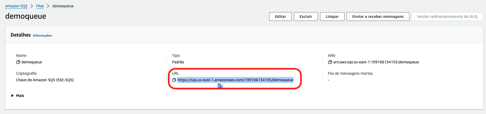
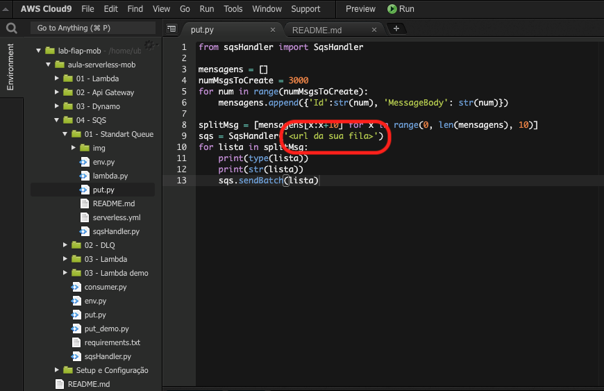
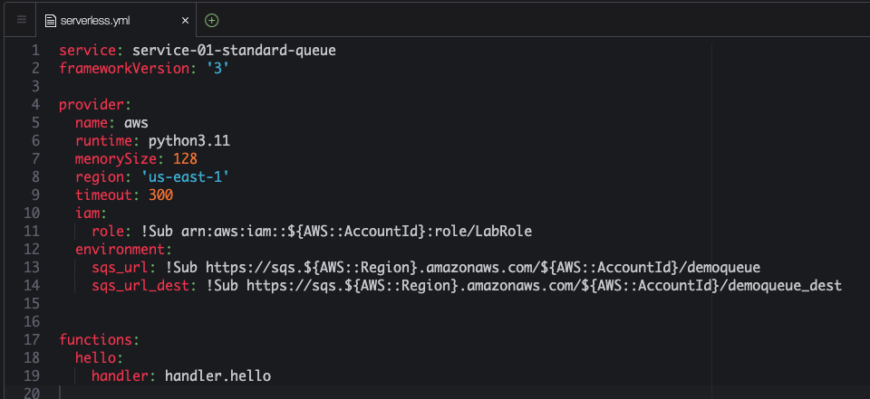

# Aula 04.1 - Standart Queue

### Criando a fila sqs

1. [Crie uma fila](https://us-east-1.console.aws.amazon.com/sqs/v3/home?region=us-east-1#/create-queue) no sqs colocando o nome 'demoqueue', deixe os valores default e clique em 'Criar Fila'
    
    

    

2. Deixe essa aba aberta, será necessária para um passo adiante.

<blockquote>

# Interação com Filas Amazon SQS via URL

A Amazon Simple Queue Service (Amazon SQS) fornece URLs exclusivas para cada fila criada. Essas URLs são usadas para interagir diretamente com as filas e são necessárias para realizar operações, como enviar e receber mensagens. A URL da fila serve como um identificador exclusivo para acessar a fila.

## Formato da URL da Fila
    A URL de uma fila geralmente segue este formato:
    ```
    https://sqs.<região>.amazonaws.com/<ID_da_conta>/<nome_da_fila>
    ```

- `<região>`: Representa a região AWS onde a fila está localizada (ex.: `us-east-1`).
- `<ID_da_conta>`: O ID da conta AWS onde a fila foi criada.
- `<nome_da_fila>`: O nome da fila criado pelo usuário.

## Utilização da URL para Operações

### Enviar Mensagens
Para enviar mensagens para uma fila, utiliza-se a URL da fila como ponto de acesso para o endpoint de envio (`SendMessage`).

### Receber Mensagens
Para receber mensagens de uma fila, a URL é usada no endpoint de recebimento (`ReceiveMessage`), permitindo que aplicações façam polling na fila.

### Excluir Mensagens
Ao processar mensagens, a URL da fila é usada na chamada de exclusão (`DeleteMessage`) para remover a mensagem da fila, garantindo que ela não seja processada novamente.

### Exemplo de Uso
Ao configurar clientes SQS nas SDKs da AWS, basta passar a URL da fila para o método de operações, conforme o exemplo:

```python
    # Exemplo em Python usando boto3
    import boto3

    # Criando o cliente SQS
    sqs = boto3.client('sqs')

    # Definindo a URL da fila
    queue_url = 'https://sqs.us-east-1.amazonaws.com/123456789012/minha-fila'

    # Enviando uma mensagem
    sqs.send_message(QueueUrl=queue_url, MessageBody='Olá, SQS!')

```

## Conclusão
As URLs de filas Amazon SQS são componentes essenciais para identificar e interagir com filas na AWS, permitindo uma integração direta e segura com a fila específica através de operações padrão oferecidas pela SQS.

</blockquote>

### Enviando dados para a fila

1. No terminal do CLoud 9 IDE criado no cloud9 execute o comando `cd ~/environment/fiap-cloud-computing-tutorials/05-SQS/01\ -\ Standard\ Queue/` para entrar na pasta que fara este exercicio.
2. Abra o arquivo put.py com o comando `c9 open put.py`
3. Volte a aba do SQS e copie a URL da fila que criou nos passos anteriores
    
    
    
4. Altere o arquivo put.py adicionando a URL da fila do sqs que criou nos passos anteriores

    

5. Execute os comandos abaixo para garantir que esta em um ambiente virtual do python com as dependencias necessárias para executar o execício:

   ``` shell
   pip3 install virtualenv && python3 -m venv ~/venv
   source ~/venv/bin/activate
   pip3 install boto3
   sudo npm i serverless@3.39.0 -g
   ```

6. Execute o comando `python3 put.py` no terminal para colocar 3000 mensagens na fila. Verifique no [console](https://us-east-1.console.aws.amazon.com/sqs/v3/home?region=us-east-1#/queues) o resultado do comando.


<details>
<summary> 
## Explicação
</summary>

<blockquote>

### Explicação do Código

```python
from sqsHandler import SqsHandler
```
- Este comando importa a classe **`SqsHandler`** de um módulo chamado **`sqsHandler`**. A **`SqsHandler`** é provavelmente uma classe personalizada que encapsula a lógica de interação com o **Amazon SQS** (como envio de mensagens em lote, recebimento de mensagens, etc.).

```python
mensagens = []
for num in range(3000):
    mensagens.append({'Id': str(num), 'MessageBody': str(num)})
```
- Cria uma lista chamada **`mensagens`** que armazenará **3000 mensagens** a serem enviadas à fila SQS.
- O laço **`for`** itera de **0** a **2999**, e em cada iteração adiciona um dicionário à lista **`mensagens`**. Cada dicionário representa uma mensagem individual no formato exigido pelo SQS, com:
  - **`Id`**: Um identificador único da mensagem (aqui, usando o valor de `num` como string).
  - **`MessageBody`**: O corpo da mensagem, que também é o valor de `num` convertido para string.

```python
splitMsg = [mensagens[x:x+10] for x in range(0, len(mensagens), 10)]
```
- Este comando usa uma **list comprehension** para dividir a lista **`mensagens`** em **sublistas de até 10 mensagens**.
- Como o **Amazon SQS** permite o envio de no máximo **10 mensagens por vez** em uma operação de envio em lote, este código divide a lista original **`mensagens`** em sublistas de tamanho 10.
- **`splitMsg`** conterá várias sublistas de mensagens, cada uma com no máximo 10 mensagens.

```python
sqs = SqsHandler('<url da sua fila>')
```
- Aqui, uma instância da classe **`SqsHandler`** é criada e configurada para apontar para a URL da fila SQS desejada. A URL da fila deve ser fornecida no lugar de **`<url da sua fila>`**.
- A **`SqsHandler`** provavelmente encapsula a lógica de envio e manipulação de mensagens SQS, incluindo operações em lote.

```python
for lista in splitMsg:
    print(type(lista))
    print(str(lista))
    sqs.sendBatch(lista)
```
- Este laço **`for`** itera sobre cada sublista **`lista`** em **`splitMsg`**.
- **`print(type(lista))`** e **`print(str(lista))`**: Exibem o tipo e o conteúdo de cada sublista (ou lote de mensagens). Cada sublista tem o tipo **`list`** e contém até 10 dicionários (cada um representando uma mensagem).
- **`sqs.sendBatch(lista)`**: Envia o lote de mensagens **`lista`** para a fila SQS utilizando o método **`sendBatch`** da instância **`SqsHandler`**. Esse método provavelmente é configurado para enviar um lote de mensagens (de até 10) para a fila SQS usando a API `send_message_batch` do **Boto3** (SDK da AWS para Python).

### Resumo

Este código cria **3000 mensagens**, divide-as em lotes de até **10 mensagens cada** (como exigido pelo SQS para envios em lote), e envia cada lote para a fila SQS usando a **`SqsHandler`**. Essa abordagem é eficiente para enviar grandes quantidades de mensagens sem exceder o limite de mensagens em uma operação em lote do SQS.

</blockquote>

</details>

### Consumindo SQS

1. [Crie mais uma fila](https://us-east-1.console.aws.amazon.com/sqs/v3/home?region=us-east-1#/create-queue) sqs utilizando o mesmo procedimento do exercicio anterior com o mesmo nome da anterior com o sulfixo '_dest', ficará `demoqueue_dest`
2. Execute o comando no terminal do cloud 9 `sls create --template "aws-python3"`
3. Abra o arquivo serverless.yml com o comando `c9 open serverless.yml`
4. Altere o arquivo 'serverless.yml' e coloque o seguinte conteudo, não esqueça de preencher as duas URLs das filas como descrito:



5. Crie o arquivo 'handler.py' com o seguinte conteudo. O abra com o seguinte comando `c9 open handler.py`

7. rode o comando `sls deploy`
8. Coloque alguns itens na fila com o comando `python3 put.py`, lembrando que cada execução do lambda criado pode consumir até 1000 posições da fila sqs.
9. Para execução do lambda rode o comando `sls invoke -l -f sqsHandler` no terminal
10. Enquando espera o comando terminar pode observar no painel do SQS as mensagens se movendo a cada atualização manual pelo canto direito superior. Lembre que cada execução move 1000 por definição no código. [Link para painel SQS](https://console.aws.amazon.com/sqs/v2/home?region=us-east-1#/queues)
    
11. Vá até o painel de [regras do cloudwath](https://us-east-1.console.aws.amazon.com/events/home?region=us-east-1#/rules?redirect_from_cwe=true) que verá a regra de execução baseada em tempo criada com o serverless framework. A regra tem nome iniciado em `sqstest`

12. Se esperar alguns execuções vai ver que a fila principal vai zerar.
13. Execute o comando `sls remove` no terminal para remover o que foi criado.
