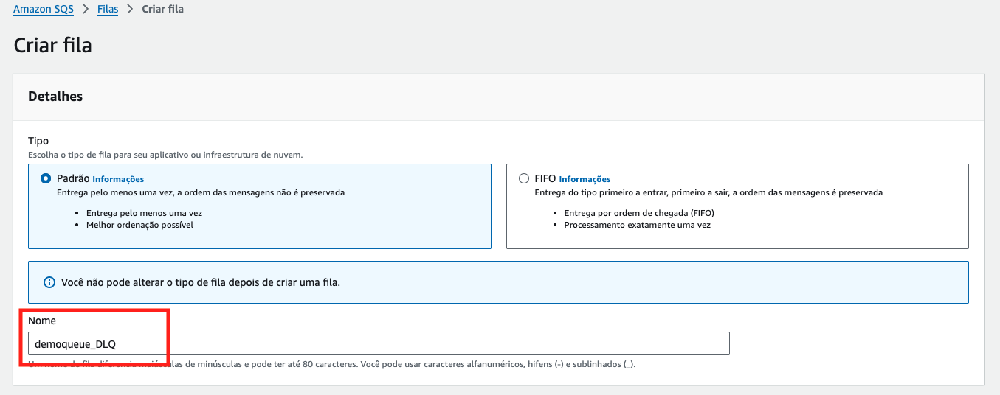
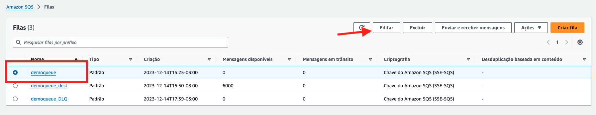
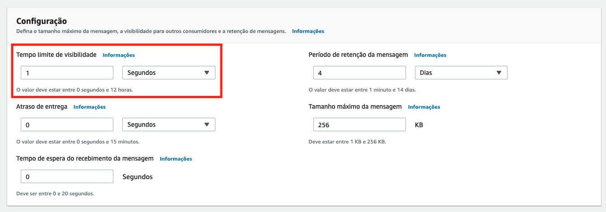
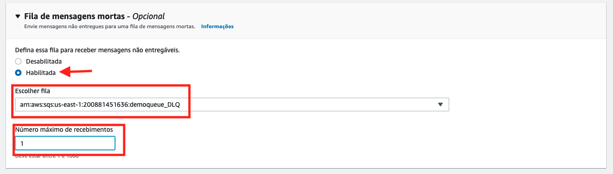

# Aula 04.2 - DLQ Queue

1. No terminal do IDE criado no cloud9 execute o comando `cd ~/environment/fiap-cloud-computing-tutorials/05-SQS/02\ -\ DLQ/` para entrar na pasta que fara este exercicio.
2. Na [aba do SQS](https://us-east-1.console.aws.amazon.com/sqs/v3/home?region=us-east-1#/create-queue) crie uma fila com o mesmo nome de uma fila já criada e coloque o sulfixo '_DLQ', ficará `demoqueue_DLQ`. Mantenha todo o restante das informação com o que esta pré preenchido.



<details>
<summary> 

**Explicação**

</summary>

<blockquote>

No Amazon SQS, uma **DLQ (Dead-Letter Queue)**, ou **Fila de Mensagens Mortas**, é uma fila especial onde são armazenadas mensagens que não puderam ser processadas com sucesso após várias tentativas. Esse conceito ajuda a isolar e gerenciar mensagens que causam falhas no sistema, possibilitando a análise e resolução de problemas específicos sem comprometer o fluxo normal de mensagens.

### Conceito de DLQ

1. **Motivação da DLQ**:
   - Quando uma mensagem na fila principal (chamada de fila "source" ou "fonte") falha em ser processada, ela retorna à fila para uma nova tentativa após o fim do **Visibility Timeout**. Se essa mensagem falhar continuamente, ela pode congestionar a fila e prejudicar a performance do sistema.
   - A DLQ permite que essas mensagens problemáticas sejam enviadas para uma fila separada após um número máximo de tentativas, isolando-as e liberando a fila principal para que apenas mensagens processáveis permaneçam.

2. **Funcionamento**:
   - Em vez de continuar tentando processar mensagens que falham repetidamente, a DLQ armazena essas mensagens. Dessa forma, as mensagens na DLQ podem ser revisadas para identificar a causa do erro (por exemplo, dados inválidos ou ausência de um recurso específico), sem interromper o fluxo de processamento normal da fila principal.
   - Ao analisar as mensagens na DLQ, os desenvolvedores podem encontrar padrões de erro e implementar correções.

### Redrive Policy

A **Redrive Policy** é a política que define como e quando as mensagens devem ser movidas da fila principal para a DLQ. Ela é configurada diretamente na fila principal e inclui duas configurações principais:

1. **deadLetterTargetArn**: 
   - Especifica o ARN (Amazon Resource Name) da DLQ associada. Esse é o identificador da fila para onde as mensagens problemáticas serão redirecionadas.

2. **maxReceiveCount**:
   - Define o **número máximo de tentativas de processamento** de uma mensagem na fila principal antes de ser movida para a DLQ.
   - Se uma mensagem atinge esse limite (por exemplo, 5 tentativas), ela é automaticamente enviada para a DLQ para evitar novas tentativas e evitar congestionamento na fila principal.

### Exemplo de Configuração da Redrive Policy

A **Redrive Policy** poderia ser configurada na fila principal com um JSON assim:

```json
{
  "deadLetterTargetArn": "arn:aws:sqs:us-east-1:123456789012:my-dead-letter-queue",
  "maxReceiveCount": 5
}
```

Neste exemplo, a fila principal tenta processar cada mensagem até 5 vezes. Após essas tentativas falharem, a mensagem é transferida automaticamente para a **DLQ** (especificada pelo **`deadLetterTargetArn`**) para investigação.

### Benefícios da DLQ e Redrive Policy

- **Isolamento de Mensagens Problemáticas**: A DLQ evita que mensagens repetidamente problemáticas impactem o fluxo normal de mensagens.
- **Facilidade de Diagnóstico**: A DLQ armazena apenas mensagens que falharam continuamente, permitindo análise e diagnóstico direcionados para resolver a causa das falhas.
- **Gerenciamento de Fluxo**: Com a **Redrive Policy**, o fluxo de mensagens problemáticas pode ser controlado automaticamente, garantindo que mensagens problemáticas não sobrecarreguem a fila principal.

Para mais detalhes, consulte a [documentação oficial sobre DLQs do Amazon SQS](https://docs.aws.amazon.com/pt_br/AWSSimpleQueueService/latest/SQSDeveloperGuide/sqs-dead-letter-queues.html).

</blockquote>

</details>


3. De volta ao painel de [listagem de filas do SQS](https://us-east-1.console.aws.amazon.com/sqs/v3/home?region=us-east-1#/queues), selecione a fila `Demoqueue` clique em `Editar` no canto superior direito



4. Preencha as informações como nas imagens, e clique me 'Salvar'. Na primeira você esta alterando o tempo de visibilidade para 1 segundo para que a mensagem volte para fila 1 segundo após ter sido entregue a um consumidor e não retirada da fila nesse meio tempo. A segunda configuração, você esta adicionando a demoqueue_DLQ como fila de mensagem mortas e configurando para que mensagens entregues mais de uma vez sejam enviadas a ela.





5. Altere o arquivo put.py colocando a URL da fila demoqueue nele, para abrir utilize `c9 open put.py` no terminal do cloud9. Para pegar a URL você pode entrar no console do SQS ou através do comando `aws sqs get-queue-url --queue-name demoqueue | jq .QueueUrl`

<details>
<summary> 

**Explicação do arquivo put.py**

</summary>

<blockquote>

Esse código em Python envia um grande número de mensagens para uma fila **Amazon SQS** (Simple Queue Service) usando uma classe personalizada chamada **`SqsHandler`**. Ele cria um total de 3000 mensagens, divide-as em lotes de até 10 mensagens cada (limite máximo para envios em lote no SQS) e envia cada lote para a fila SQS de forma sequencial.

### Explicação do Código

```python
from sqsHandler import SqsHandler
```
- Importa a classe **`SqsHandler`** de um módulo personalizado chamado **`sqsHandler`**. Essa classe provavelmente encapsula métodos para interagir com a fila SQS, como enviar mensagens em lote.

### Preparação das Mensagens

```python
mensagens = []
numMsgsToCreate = 3000
for num in range(numMsgsToCreate):
    mensagens.append({'Id': str(num), 'MessageBody': str(num)})
```
- **`mensagens = []`**: Inicializa uma lista vazia chamada **`mensagens`** que armazenará todas as mensagens a serem enviadas para a fila SQS.
- **`numMsgsToCreate = 3000`**: Define o número de mensagens a serem criadas. Aqui, o código cria **3000 mensagens**.
- **`for num in range(numMsgsToCreate):`**: Itera **3000 vezes**, de 0 até 2999.
  - **`mensagens.append({'Id': str(num), 'MessageBody': str(num)})`**: Em cada iteração, cria um dicionário que representa uma mensagem. O dicionário tem duas chaves:
    - **`'Id'`**: Um identificador único para cada mensagem, usando o valor de **`num`** como string.
    - **`'MessageBody'`**: O conteúdo da mensagem, também usando o valor de **`num`** como string.

No final desse laço, a lista **`mensagens`** contém 3000 mensagens, cada uma com um identificador e um corpo de mensagem.

### Divisão das Mensagens em Lotes

```python
splitMsg = [mensagens[x:x+10] for x in range(0, len(mensagens), 10)]
```
- Esse código utiliza uma **list comprehension** para dividir a lista **`mensagens`** em sublistas de até **10 mensagens cada**. O Amazon SQS permite o envio de no máximo **10 mensagens por vez** em um único envio em lote, então essa divisão é necessária para garantir que cada envio esteja dentro do limite.
- **`splitMsg`** conterá uma lista de sublistas, onde cada sublista representa um lote de até 10 mensagens.

### Envio dos Lotes para a Fila SQS

```python
sqs = SqsHandler('<SUA URL DE FILA SQS>')
for lista in splitMsg:    
    print(type(lista))
    print(str(lista))
    sqs.sendBatch(lista)
```

1. **`sqs = SqsHandler('<SUA URL DE FILA SQS>')`**: 
   - Cria uma instância da classe **`SqsHandler`**, que é configurada para interagir com a fila SQS de destino. 
   - A URL da fila SQS (que precisa ser substituída por uma URL real) é passada para o construtor **`SqsHandler`**.

2. **Iteração sobre os Lotes**:
   ```python
   for lista in splitMsg:    
       print(type(lista))
       print(str(lista))
       sqs.sendBatch(lista)
   ```
   - **`for lista in splitMsg:`**: Itera sobre cada sublista (lote) na lista **`splitMsg`**.
   - **`print(type(lista))`** e **`print(str(lista))`**: Exibe o tipo e o conteúdo do lote para monitoramento. **`type(lista)`** retorna **`list`** e **`str(lista)`** mostra o conteúdo de cada lote de até 10 mensagens.
   - **`sqs.sendBatch(lista)`**: Chama o método **`sendBatch`** da instância **`sqs`** para enviar o lote de mensagens para a fila SQS. Esse método provavelmente usa o método `send_message_batch` do Boto3 para enviar as mensagens em lote à fila.

### Resumo

1. O código cria 3000 mensagens com identificadores e conteúdos simples.
2. As mensagens são divididas em lotes de até 10, conforme o limite do SQS.
3. Cada lote é enviado para a fila SQS usando o método **`sendBatch`** da classe **`SqsHandler`**.

Esse método é eficiente para enviar grandes volumes de mensagens para o SQS em lotes, o que reduz a quantidade de chamadas à API e ajuda a otimizar o processo de envio.

</blockquote>

</details>

<details>
<summary> 

**Explicação do comando que pega URL da fila**

</summary>

<blockquote>

Este comando em **AWS CLI** é utilizado para recuperar a URL de uma fila **Amazon SQS** chamada **`demoqueue`** e exibi-la no terminal em formato legível usando o **`jq`**. Vamos detalhar cada parte do comando:

### Comando Completo

```bash
aws sqs get-queue-url --queue-name demoqueue | jq .QueueUrl
```

### Explicação do Comando

1. **`aws sqs get-queue-url`**:
   - Esta parte do comando usa a **AWS CLI** para interagir com o serviço **Amazon SQS** (Simple Queue Service).
   - **`get-queue-url`**: Este subcomando solicita a URL de uma fila SQS existente. A URL da fila é necessária para realizar operações com ela, como envio ou recebimento de mensagens.

2. **`--queue-name demoqueue`**:
   - **`--queue-name`**: Especifica o nome da fila SQS para a qual queremos obter a URL.
   - **`demoqueue`**: É o nome da fila SQS para a qual a URL será recuperada. Esse valor deve ser alterado para o nome real da sua fila, caso você tenha outra fila em uso.

3. **`| jq .QueueUrl`**:
   - **`|`**: O operador de **pipe** envia a saída do comando anterior para o comando seguinte.
   - **`jq .QueueUrl`**: `jq` é uma ferramenta de linha de comando para processar e manipular dados JSON.
     - **`.QueueUrl`**: Esse argumento filtra o JSON resultante para exibir apenas o valor da chave **`QueueUrl`**, que contém a URL da fila.

### Funcionamento do Comando

- O comando **`aws sqs get-queue-url --queue-name demoqueue`** retorna um JSON contendo a URL da fila, por exemplo:
  ```json
  {
    "QueueUrl": "https://sqs.us-east-1.amazonaws.com/123456789012/demoqueue"
  }
  ```
- O **`jq .QueueUrl`** extrai apenas o valor da chave **`QueueUrl`**, exibindo-o diretamente no terminal:
  ```plaintext
  https://sqs.us-east-1.amazonaws.com/123456789012/demoqueue
  ```

### Finalidade do Comando

Esse comando é útil quando você precisa da URL exata de uma fila SQS para usá-la em outros comandos ou scripts, especialmente em operações que exigem o endpoint da fila, como envio ou recebimento de mensagens.

</blockquote>

</details>

6. execute o comando `python3 put.py` no terminal
7. Faça as alterações no arquivo consumer.py(`c9 open consumer.py`)conforme a imagem a baixo, não esquecendo de colcoar sua URL da demoqueue forneciada pelo comando anterior:


<details>
<summary> 

**Explicação**

</summary>

<blockquote>

Além do **Visibility Timeout** de **1 segundo**, este código interage com uma fila SQS que possui uma **DLQ (Dead-Letter Queue)** configurada para mover mensagens após **1 tentativa de recebimento falhada**. Essa configuração faz com que a mensagem seja enviada para a DLQ se ela for lida uma vez e não for deletada da fila principal (considerada como "falha de processamento").

### Explicação do Código

```python
from sqsHandler import SqsHandler
import time

sqs = SqsHandler('https://sqs.us-east-1.amazonaws.com/716341060650/demoqueue')
```

- **`from sqsHandler import SqsHandler`**: Importa a classe **`SqsHandler`**, que encapsula a lógica para interagir com a fila SQS (operações de recebimento, envio e exclusão de mensagens).
- **`import time`**: Importa o módulo **time** para usar a função **`sleep`**, que pausa a execução do código por um determinado tempo.
- **`sqs = SqsHandler('https://sqs.us-east-1.amazonaws.com/716341060650/demoqueue')`**: Cria uma instância de **`SqsHandler`** para interagir com a fila SQS chamada **`demoqueue`**.

### Loop de Recuperação de Mensagens

```python
while(True):
    response = sqs.getMessage(10)
    if(len(response['Messages']) == 0):
        break

    time.sleep(1)
```

- **`while(True):`**: Inicia um loop infinito que continuará até que não haja mais mensagens disponíveis na fila.
  
- **`response = sqs.getMessage(10)`**: Tenta recuperar até **10 mensagens** da fila usando **`sqs.getMessage`**.
  
- **`if(len(response['Messages']) == 0): break`**: Verifica se não há mensagens retornadas na chamada. Se o valor for zero, o loop é interrompido.
  
- **`time.sleep(1)`**: Pausa a execução por **1 segundo** antes da próxima tentativa de leitura.

### Comportamento com Visibility Timeout de 1 Segundo e DLQ Configurada

1. **Leitura e Invisibilidade Temporária da Mensagem**:
   - Quando uma mensagem é lida da fila com **`sqs.getMessage(10)`**, ela se torna invisível para outros consumidores pelo período do **Visibility Timeout**, que é de apenas **1 segundo**.
   - Durante esse tempo, a mensagem fica "em trânsito" e não pode ser lida por outros consumidores.

2. **Reaparecimento da Mensagem e Efeito da DLQ**:
   - Após o **Visibility Timeout** de 1 segundo, a mensagem reaparece na fila, pois o código não a remove (não exclui).
   - Como a **DLQ** (Dead-Letter Queue) está configurada para mover mensagens após **1 tentativa de recebimento falhada**, a mensagem será transferida automaticamente para a DLQ na próxima tentativa de leitura.
   - Isso ocorre porque a configuração de **1 tentativa de recebimento** indica que, após a mensagem ser recebida e não excluída uma vez, ela será enviada para a DLQ.

3. **Processo Final da Mensagem**:
   - Com o **Visibility Timeout** curto e a **Redrive Policy** configurada para mover a mensagem após 1 tentativa de leitura, a mensagem é lida uma vez, reaparece na fila, e é enviada para a DLQ no ciclo seguinte.
   - Como resultado, a mensagem não ficará em um loop infinito de reprocessamento, mas será transferida para a DLQ após a primeira falha de processamento.

### Conclusão

Neste cenário, o **Visibility Timeout** de 1 segundo combinado com a **Redrive Policy** de **1 tentativa** na DLQ faz com que cada mensagem seja lida uma vez, se torne invisível por 1 segundo, e seja movida para a DLQ após a segunda leitura. Isso evita reprocessamento infinito, mas direciona as mensagens que falham na exclusão para a DLQ. Essa configuração é útil para capturar e analisar mensagens problemáticas sem sobrecarregar a fila principal.

Para mais informações sobre **DLQs** e **Visibility Timeout** no SQS, consulte a [documentação oficial da AWS](https://docs.aws.amazon.com/pt_br/AWSSimpleQueueService/latest/SQSDeveloperGuide/sqs-dead-letter-queues.html).

</blockquote>

</details>

8. Execute o comando `python3 consumer.py` no terminal
9. Observe que enquanto roda o script a fila DLQ é populada no console do SQS. [Link para painel SQS](https://console.aws.amazon.com/sqs/v2/home?region=us-east-1#/queues)
    
    