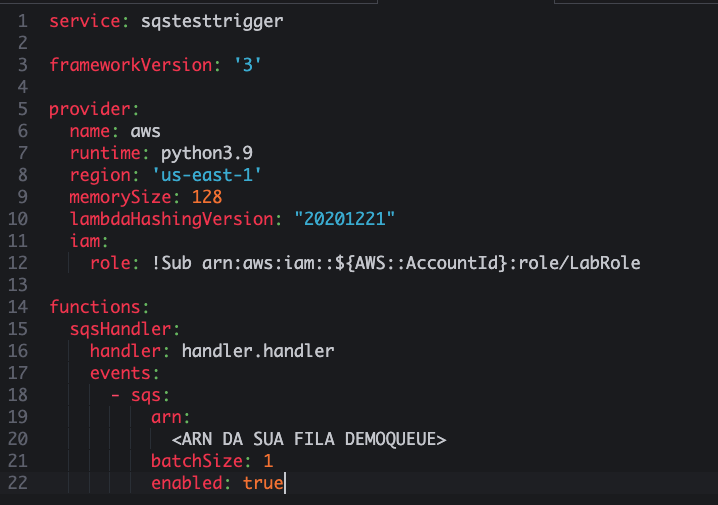
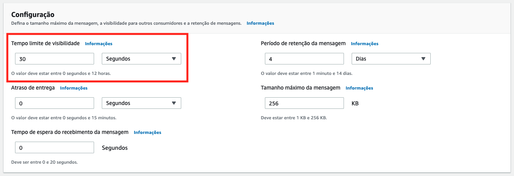
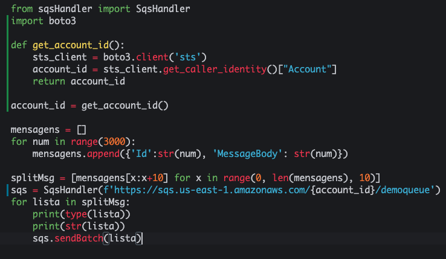

# Aula 04.3 - Lambda

1. No terminal do IDE criado no cloud9 execute o comando `cd ~/environment/fiap-cloud-computing-tutorials/05-SQS/03\ -\ Lambda` para entrar na pasta que fara este exercicio.
2. Execute o comando `sls create --template "aws-python3"` no terminal para criar os arquivos do serverless framework.
3. Altere o handler.py para ficar como na imagem. Não esqueça de colocar a URL da sua fila de destino. Abra com o comando `c9 open handler.py`. Para conseguir a URL da fila de destino você pode utilizar o comando `aws sqs get-queue-url --queue-name demoqueue_dest | jq .QueueUrl`

   
   
<details>
<summary> 

**Explicação**

</summary>

<blockquote>

Este código em Python implementa uma função **AWS Lambda** que recebe eventos de uma fila **Amazon SQS**. A função processa cada mensagem do evento, exibe seu conteúdo no log e então encaminha o conteúdo para outra fila (ou a mesma, dependendo da URL usada) usando a classe **`SqsHandler`**.

### Explicação do Código

```python
import json
from sqsHandler import SqsHandler
```

- **`import json`**: Importa o módulo **`json`**, que permite manipular dados JSON, como conversão entre strings JSON e objetos Python.
- **`from sqsHandler import SqsHandler`**: Importa a classe **`SqsHandler`**, que encapsula a lógica de interação com o Amazon SQS, incluindo o envio de mensagens para a fila SQS.

### Função Lambda `handler`

```python
def handler(event, context):
```

- A função **`handler`** é o ponto de entrada da função Lambda. Quando uma mensagem chega na fila SQS e a função Lambda é configurada para processá-la, o **AWS Lambda** invoca essa função automaticamente.
- **`event`**: Contém os dados do evento que acionou a função Lambda. No caso de um evento SQS, esse objeto inclui informações detalhadas sobre as mensagens que foram lidas da fila.
- **`context`**: Contém informações sobre o contexto de execução da função Lambda, como o tempo de execução restante e o nome da função. Não é utilizado diretamente aqui, mas pode ser útil em outras implementações.

### Exibição do Evento Completo

```python
    print(json.dumps(event))
```

- **`print(json.dumps(event))`**: Converte o **`event`** para uma string JSON e o exibe no log. Isso permite visualizar todo o evento recebido do SQS no log da função Lambda, o que é útil para monitoramento e depuração.

### Instanciação da Classe `SqsHandler`

```python
    sqs = SqsHandler('<SUA URL DO SQS>')
```

- **`sqs = SqsHandler('<SUA URL DO SQS>')`**: Cria uma instância da classe **`SqsHandler`** configurada para interagir com uma fila SQS específica. A URL da fila é fornecida como argumento e deve ser substituída por uma URL válida da fila de destino.
- Essa instância **`sqs`** é utilizada posteriormente para enviar mensagens para a fila SQS.

### Processamento das Mensagens Recebidas

```python
    for record in event["Records"]:
        payload = record["body"]
        print(json.dumps(payload))
        sqs.send(payload)
```

- **`for record in event["Records"]:`**: Itera sobre cada mensagem individual (ou "registro") que está presente no **`event["Records"]`**.
  - Quando o SQS invoca a função Lambda, ele pode enviar várias mensagens ao mesmo tempo, dependendo da configuração. Cada mensagem é armazenada como um item na lista **`Records`**.

- **`payload = record["body"]`**: Extrai o corpo da mensagem atual. No objeto **`record`**, a chave **`body`** contém o conteúdo principal da mensagem, que pode ser um texto ou um JSON.
  
- **`print(json.dumps(payload))`**: Exibe o **payload** da mensagem no log em formato JSON para monitoramento, mostrando o conteúdo de cada mensagem recebida.

- **`sqs.send(payload)`**: Envia o conteúdo da mensagem extraída para a fila SQS especificada pela URL passada para o **`SqsHandler`**. O método **`send`** da classe **`SqsHandler`** provavelmente encapsula o envio de mensagens para a fila SQS.

### Retorno do Evento

```python
    return event
```

- **`return event`**: A função Lambda retorna o **`event`** original. Isso não é obrigatório para o funcionamento, mas pode ser útil se outros sistemas ou processos precisarem de informações sobre as mensagens processadas.

### Funcionamento com o SQS

Quando essa função Lambda é acionada por uma fila SQS:
1. Ela recebe um **evento** que contém uma lista de mensagens.
2. O código exibe cada mensagem no log e, em seguida, envia seu conteúdo para outra fila SQS (ou a mesma fila, dependendo da URL).

Esse processo permite o roteamento de mensagens entre filas SQS, com uma exibição detalhada de logs de cada mensagem, facilitando o monitoramento e a análise das mensagens em trânsito.

</blockquote>

</details>

4. Altere o serverless.yml para que fique como na imagem. Para abrir utilize `c9 open serverless.yml `. Para pegar o ARN da fila demoqueue utilize o comando abaixo:
``` shell
demoqueueURL=`aws sqs get-queue-url --queue-name demoqueue | jq -r .QueueUrl` && aws sqs get-queue-attributes --queue-url $demoqueueURL --attribute-names QueueArn | jq -r .Attributes.QueueArn
```
   
   

<details>
<summary> 

**Explicação do serverless.yml**

</summary>

<blockquote>

Este arquivo **`serverless.yml`** configura uma função **AWS Lambda** chamada **`sqsHandler`** para ser automaticamente acionada por eventos provenientes de uma fila **Amazon SQS**. Vamos detalhar cada parte do código:

### Estrutura da Função Lambda

```yaml
functions:
  sqsHandler:
    handler: handler.handler
    events:
      - sqs:
          arn:
            ARN DA FILA SQS
          batchSize: 1
          enabled: true
```

1. **`functions:`**
   - Esta seção define as funções Lambda que serão implantadas. Cada função configurada nesta seção será criada como uma função Lambda na AWS.

2. **`sqsHandler:`**
   - É o nome da função Lambda configurada, chamada **`sqsHandler`**. Este nome é usado internamente pelo Serverless Framework e aparece no console da AWS.

3. **`handler: handler.handler`**
   - Define o ponto de entrada para a função Lambda.
   - **`handler`** é o nome do arquivo onde a função está localizada (por exemplo, `handler.py`).
   - **`handler`** após o ponto refere-se à função dentro do arquivo que será executada (por exemplo, `handler.py` deve conter uma função chamada `handler`). Isso significa que quando a função Lambda for invocada, o Serverless Framework executará `handler.handler`.

### Configuração do Evento SQS

```yaml
events:
  - sqs:
      arn:
        ARN DA FILA SQS
      batchSize: 1
      enabled: true
```

Esta seção configura a função Lambda para ser acionada por eventos de uma fila **Amazon SQS**. As propriedades especificadas aqui controlam como a função responde aos eventos do SQS.

1. **`events:`**
   - Define os eventos que irão acionar a função Lambda. Neste caso, a função é acionada por um evento de **SQS**.

2. **`- sqs:`**
   - Especifica que o evento que acionará a função será de uma **fila SQS**.

3. **`arn:`**
   - Define o **ARN (Amazon Resource Name)** da fila SQS que está vinculada a essa função Lambda. O **ARN** identifica unicamente a fila que irá enviar os eventos para a função. Substitua **`ARN DA FILA SQS`** pelo ARN real da sua fila SQS, que deve ter o formato `arn:aws:sqs:<region>:<account-id>:<queue-name>`.

4. **`batchSize: 1`**
   - Define o número máximo de mensagens que a função Lambda receberá em uma única invocação. Com o valor **`1`**, cada execução da função Lambda processará uma mensagem por vez.
   - Ajustar esse valor pode ajudar a otimizar o consumo de mensagens; valores mais altos aumentam o número de mensagens processadas por invocação.

5. **`enabled: true`**
   - Este parâmetro habilita o evento para a função Lambda. Quando **`enabled`** é **`true`**, a função está ativa e pronta para processar mensagens da fila SQS.
   - Configurar **`enabled: false`** desativaria a função, impedindo-a de ser acionada por eventos da fila.

### Resumo

Este arquivo **`serverless.yml`** configura uma função Lambda chamada **`sqsHandler`** para ser acionada por mensagens de uma fila SQS específica. A função é invocada para cada mensagem (devido ao **`batchSize: 1`**) e está habilitada para responder a eventos da fila (graças a **`enabled: true`**). Esse tipo de configuração é útil para processar mensagens individualmente, garantindo que cada mensagem da fila seja tratada por uma execução da função Lambda.

</blockquote>

</details>


<details>
<summary> 

**Explicação comando para recuperar ARN da fila**

</summary>

<blockquote>

Este comando em **AWS CLI** realiza duas operações sequenciais para obter o **ARN (Amazon Resource Name)** de uma fila **Amazon SQS** chamada **`demoqueue`** e armazena o resultado em uma variável.

### Comando Completo

```bash
demoqueueURL=`aws sqs get-queue-url --queue-name demoqueue | jq -r .QueueUrl` && aws sqs get-queue-attributes --queue-url $demoqueueURL --attribute-names QueueArn | jq -r .Attributes.QueueArn
```

### Explicação do Comando em Partes

1. **Recupera a URL da Fila SQS**
   ```bash
   demoqueueURL=`aws sqs get-queue-url --queue-name demoqueue | jq -r .QueueUrl`
   ```

   - **`aws sqs get-queue-url --queue-name demoqueue`**: Usa a **AWS CLI** para obter a **URL** da fila chamada **`demoqueue`**.
   - **`| jq -r .QueueUrl`**: O operador **`|`** passa o resultado para **`jq`**, que é usado para filtrar e extrair o valor da chave **`QueueUrl`** no JSON retornado, sem aspas (`-r` para saída bruta).
   - **`demoqueueURL=`...**: O valor extraído é armazenado na variável **`demoqueueURL`**, que agora contém a URL da fila **`demoqueue`**.

2. **Recupera o ARN da Fila SQS**
   ```bash
   aws sqs get-queue-attributes --queue-url $demoqueueURL --attribute-names QueueArn | jq -r .Attributes.QueueArn
   ```

   - **`aws sqs get-queue-attributes --queue-url $demoqueueURL --attribute-names QueueArn`**: Usa a **AWS CLI** para obter o **ARN** da fila SQS utilizando a URL armazenada em **`demoqueueURL`**.
     - **`--queue-url $demoqueueURL`**: Define a URL da fila, passada pela variável **`$demoqueueURL`**.
     - **`--attribute-names QueueArn`**: Especifica que o comando deve retornar apenas o atributo **`QueueArn`**.
   - **`| jq -r .Attributes.QueueArn`**: O operador **`|`** envia o resultado para **`jq`**, que extrai o valor de **`QueueArn`** do JSON retornado, removendo aspas ao redor do valor (`-r`).
   
   O comando exibe diretamente o **ARN** da fila **`demoqueue`** no terminal.

### Resumo do Funcionamento

- Este comando em duas partes primeiro obtém a URL de uma fila SQS chamada **`demoqueue`** e a armazena na variável **`demoqueueURL`**.
- Em seguida, usa essa URL para consultar o **ARN** da fila SQS e exibe o **ARN** no terminal. Isso é útil para obter o ARN de uma fila SQS sem precisar buscar manualmente.

</blockquote>

</details>
   
5. **ANTES DE FAZER DEPLOY** Vá a sua [console do SQS](https://us-east-1.console.aws.amazon.com/sqs/v3/home?region=us-east-1#/queues) e configure sua demoqueue para ficar como na imagem, isso é necessário pois o tempo de visibilidade padrão estava em 1 segundo para forçar erros no teste da DLQ do ultimo exercicio:

   

6. Execute o comando abaixo para rodar a operação de purge na fila demoqueue:
``` shell
aws sqs purge-queue --queue-url $(aws sqs get-queue-url --queue-name demoqueue --output text)
``` 

<details>
<summary> 

**Explicação**

</summary>

<blockquote>

Para esvaziar uma fila chamada **`demoqueue`** no **AWS SQS** usando o **AWS CLI**, você pode utilizar o comando **`purge-queue`**. Este comando remove todas as mensagens da fila, mas observe que ele não é reversível e pode levar alguns minutos para completar.

### Explicação do Comando

1. **`aws sqs get-queue-url --queue-name demoqueue --output text`**:
   - Obtém a URL da fila chamada **`demoqueue`**.
   - **`--output text`** faz com que a URL seja retornada como texto simples, facilitando o uso no comando `purge-queue`.

2. **`aws sqs purge-queue --queue-url $(...)`**:
   - **`purge-queue`**: Comando que esvazia todas as mensagens da fila.
   - **`--queue-url $(...)`**: A opção **`--queue-url`** especifica a URL da fila a ser esvaziada. Aqui, a URL é obtida dinamicamente usando o comando **`aws sqs get-queue-url`** dentro da substituição **`$(...)`**.

### Observação Importante

O comando **`purge-queue`** remove **todas as mensagens da fila**, tanto as mensagens em espera quanto as em trânsito, e pode levar alguns minutos para completar o processo.

</blockquote>

</details>


7. Execute o comando `sls deploy` no terminal do cloud9.
8. Abra com `c9 open put.py`. Veja que ele completa a URL da fila demoqueue apenas adicionando o numero da conta da AWS automaticamente. 
   
   

9. Execute o comando `python3 put.py` no terminal e observe no [painel do sqs](https://us-east-1.console.aws.amazon.com/sqs/v3/home?region=us-east-1#/queues) que as mensagens estão indo para a fila de destino.
    
   
   
10. Para excluir a stack do lambda execute o comando `sls remove` no terminal.
