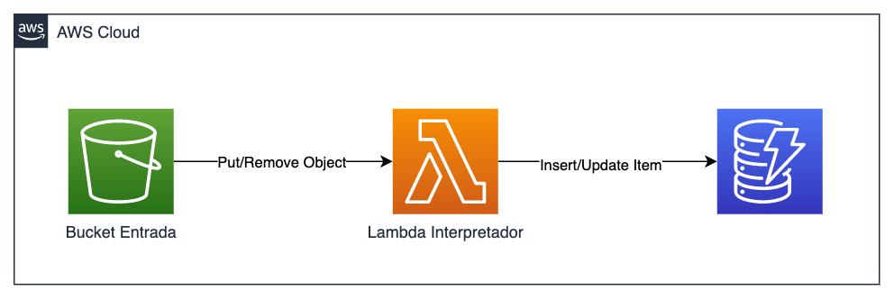

# Desafio Final

1. Crie um S3 onde tenha uma pasta chamada `entrada-dados`
2. Utilizando serverless framework crie um lambda que monitore a criação e delete de objetos com extenção `.json` na pasta `entrada-dados` do bucket criado.
3. Crie uma tabela no DynanoDB que terá 2 campos:
   1. nomearquivo: String (PK)
   2. ativo: Bool
4. O lambda que recebe a trigger do S3 deve inserir a informação no banco de dados da seguinte forma:
   1. PutObject: Nome do arquivo + ativo = true
   2. RemoveObject: Nome do arquivo + ativo = false

5. A entrega consiste nos arquivos para provisionar o lambda e o código do lambda.
6. Faça um zip dos arquivos(Pode ser do github) e submeta no portal da fiap.

### Dicas & Recomendações

1. [Trigger de S3 em serverless](https://www.serverless.com/framework/docs/providers/aws/events/s3)
2. Nos exercicios de DynamoDB existem uma classe em Python que insere dados em uma tabela do dynanoDB
3. O trabalho pode ser executado em qualquer linguagem suportada prlo lambda.
4. Não esqueça do existing: True no serverless.yml porque você já criou o bucket. Vide documentação no item 1